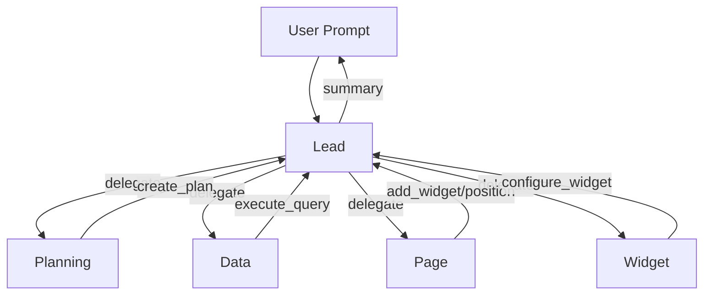
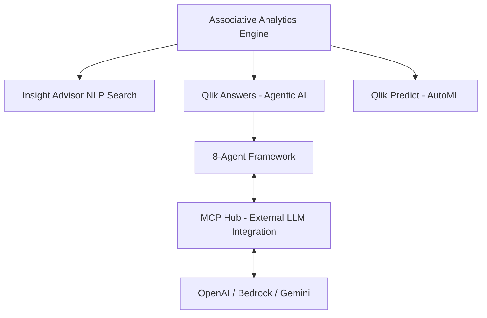
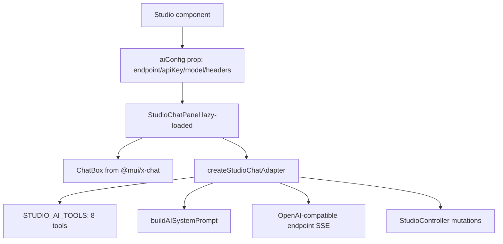
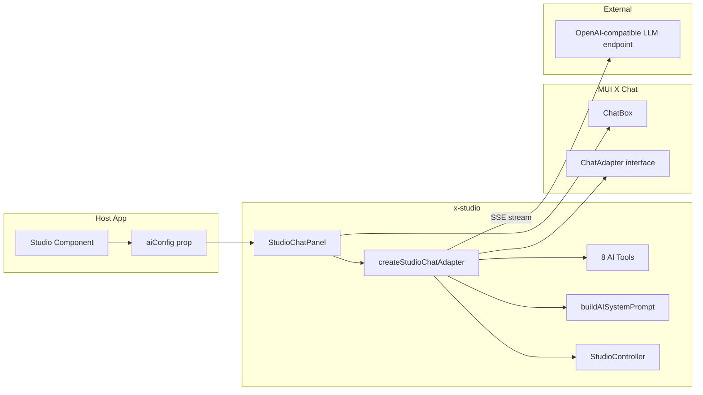
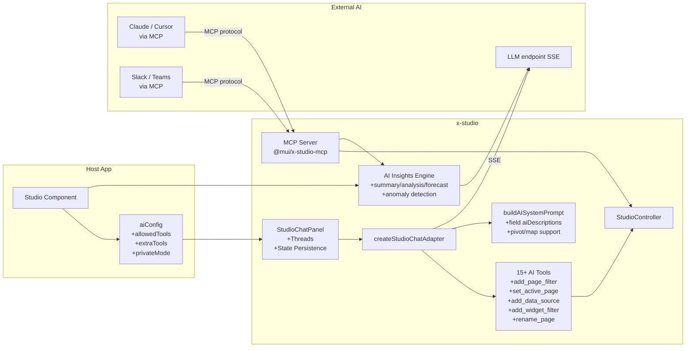

# AI Assistant Research: Charts & Dashboard BI AI Assistants

> **Purpose:** Market research and feature gap analysis to guide AI assistant enhancements for `@mui/x-studio`.
> **Date:** May 2026
> **Scope:** Competing AI-powered analytics/BI tools, current x-studio AI state, and prioritised recommendations.

---

## Executive Summary

The embedded analytics market has undergone a rapid AI transformation. In 2025–2026, every major BI vendor added conversational AI, and the gap between "basic NL-to-chart" and "agentic multi-step analytics" has widened. `@mui/x-studio` currently implements a competent **8-tool OpenAI-compatible chat assistant** that can build dashboards from natural language — comparable to AG Grid Studio's approach in terms of interaction model, but trailing on several high-value features: AI-generated insights/summaries, anomaly detection, forecasting, MCP integration, multi-thread conversations, and semantic layer metadata support. The most impactful enhancements are: fixing 7 documented-but-unimplemented features, adding AI insight generation (summaries + analysis), implementing page-filter and data-source tools, persistent conversation state, and an MCP server for external agent integration.

---

## Table of Contents

1. [Market Landscape](#1-market-landscape)
2. [Competitor Deep-Dives](#2-competitor-deep-dives)
   - [AG Grid Studio AI](#21-ag-grid-studio-ai)
   - [Reveal BI AI](#22-reveal-bi-ai)
   - [Qlik Cloud Analytics & AI](#23-qlik-cloud-analytics--ai)
   - [Highcharts Orbit](#24-highcharts-orbit)
   - [Luzmo IQ](#25-luzmo-iq)
   - [Embeddable](#26-embeddable)
   - [Microsoft Power BI Copilot](#27-microsoft-power-bi-copilot)
   - [Tableau AI / Agentforce](#28-tableau-ai--agentforce)
   - [ThoughtSpot Spotter](#29-thoughtspot-spotter)
   - [Looker AI](#210-looker-ai)
   - [Sisense Intelligence](#211-sisense-intelligence)
   - [Metabase Metabot](#212-metabase-metabot)
   - [Amazon Quick (QuickSight + Q)](#213-amazon-quick-quicksight--q)
   - [Grafana AI](#214-grafana-ai)
   - [Hex Magic AI](#215-hex-magic-ai)
   - [Retool AI](#216-retool-ai)
   - [Observable AI](#217-observable-ai)
   - [Microsoft LIDA (Open Source)](#218-microsoft-lida-open-source)
3. [Cross-Cutting Patterns](#3-cross-cutting-patterns)
4. [Current x-studio AI State](#4-current-x-studio-ai-state)
5. [Gap Analysis](#5-gap-analysis)
6. [Recommended Enhancements](#6-recommended-enhancements)
7. [Architecture Diagram](#7-architecture-diagram)
8. [Confidence Assessment](#8-confidence-assessment)
9. [Footnotes](#9-footnotes)

---

## 1. Market Landscape

### The Transformation

In 2024–2026, AI moved from being a BI add-on to the primary interaction model. Three tiers have emerged:

| Tier                   | Description                                                            | Examples                                              |
| ---------------------- | ---------------------------------------------------------------------- | ----------------------------------------------------- |
| **Table Stakes**       | Every vendor has NL querying, chart summaries, basic AI chat           | Power BI Copilot, Grafana AI, Metabase Metabot        |
| **Advanced / Agentic** | Multi-step reasoning, automated dashboard creation, proactive insights | ThoughtSpot Spotter, Looker Agents, AG Grid Studio AI |
| **Platform-Level**     | AI spans the full data lifecycle — prep, exploration, ML, automation   | Qlik, Amazon Quick, Hex.tech                          |

### Key Industry Patterns

1. **Semantic Layer as AI Governance** — Everyone is racing to own the semantic/business logic layer as the anti-hallucination foundation. AI agents that query raw SQL hallucinate; those grounded in a governed semantic layer don't.

2. **MCP (Model Context Protocol) Land Grab** — MCP is becoming the standard protocol connecting LLMs to data tools. Tableau, Metabase, Sisense, ThoughtSpot, and Hex all ship MCP servers. BI is evolving from a destination (users go to dashboards) to a service (AI agents call BI via MCP).

3. **Agentic BI vs. Augmented BI** — Clear split: _augmented_ AI helps humans (Power BI, Grafana), _agentic_ AI acts autonomously on multi-step tasks (ThoughtSpot Spotter 3, Looker Conversational Analytics).

4. **Multi-Agent Orchestration** — AG Grid Studio and ThoughtSpot use specialised sub-agents (Lead, Planning, Data, Widget agents) rather than a single monolithic prompt. More reliable dashboard construction.

5. **Embedded AI is the B2B Battleground** — Metabase, Sisense, Reveal BI, Luzmo, and Embeddable all heavily target ISVs embedding AI analytics into customer-facing SaaS products.

---

## 2. Competitor Deep-Dives

### 2.1 AG Grid Studio AI

**URL:** [ag-grid.com/studio/react/ai/](https://www.ag-grid.com/studio/react/ai/)

**Summary:** The closest direct competitor to `@mui/x-studio`. A commercial embedded analytics dashboard builder with an **experimental multi-agent AI assistant** ("Agentic Experience / AX"). Requires "AG Studio Pro with AI" licence.[^1]

#### Architecture: 5-Agent System (AX)

The AI does not use a single monolithic prompt. Instead, it routes through **five specialised agent profiles** that collaborate:[^2]

| Profile      | Role                                             | Key Tools                                              |
| ------------ | ------------------------------------------------ | ------------------------------------------------------ |
| **Lead**     | Coordinator — receives user messages, delegates  | `view_schema`, `view_page`, `view_plan`, `delegate_to` |
| **Planning** | Creates structured plans before execution        | `view_schema`, `create_plan`                           |
| **Data**     | Explores data sources, answers data questions    | `execute_query`, `view_schema`                         |
| **Page**     | Places widgets, manages positions & page filters | `add_widget`, `position_widget`, `add_page_filter`     |
| **Widget**   | Configures individual widgets (per-type)         | `view_widget`, `configure_widget`, `add_widget_filter` |



#### AI Tool Reference (22 tools total)

`view_schema`, `execute_query`, `view_page`, `view_plan`, `view_widget`, `add_widget`, `position_widget`, `remove_widget`, `configure_widget`, `add_widget_filter`, `remove_widget_filter`, `add_page_filter`, `remove_page_filter`, `create_plan`, `update_plan`, `clear_plan`, `rename_thread`, `delegate_to`, `complete_task`[^3]

#### Key Differentiators vs x-studio

| Feature                                  | AG Studio                           | x-studio                                |
| ---------------------------------------- | ----------------------------------- | --------------------------------------- |
| Multi-agent orchestration                | ✅ 5 agents                         | ❌ Single adapter                       |
| Structured planning before execution     | ✅ Plan shown to user               | ❌                                      |
| Named conversation threads               | ✅ Multiple persistent threads      | ❌ Single conversation                  |
| `execute_query` (data questions)         | ✅                                  | ❌                                      |
| `add_page_filter` / `remove_page_filter` | ✅                                  | ❌                                      |
| `add_widget_filter` (per-widget)         | ✅                                  | ❌                                      |
| `rename_thread`                          | ✅                                  | ❌                                      |
| State persistence (AI + dashboard)       | ✅ `getState()`/`setState()`        | ❌ No AI state persistence              |
| Custom widget AI integration             | ✅ `formatShape` + `ai` metadata    | ⚠️ Partial (customWidgets context only) |
| LLM-agnostic by design                   | ✅ Adapter interface                | ✅ OpenAI-compatible endpoint           |
| Streaming                                | ✅ `AsyncIterable<AgAiStreamEvent>` | ✅ SSE streaming                        |

#### Integration API

AG Studio is LLM-agnostic — developers implement the `AgAiAssistant` interface (`executeTurn`), which returns `stream: AsyncIterable<AgAiStreamEvent>`. The adapter never executes tools — AG Studio intercepts tool calls internally.[^4]

---

### 2.2 Reveal BI AI

**URL:** [revealbi.io/ai](https://www.revealbi.io/ai)

**Summary:** AI-native embedded analytics with BYOLLM architecture (Bring Your Own LLM). Released March 2026. Never hosts your data or stores it — all AI runs server-side against your own LLM provider.[^5]

#### Feature Set

| Feature                     | Description                                                              |
| --------------------------- | ------------------------------------------------------------------------ |
| **AI Insights API**         | Three types: Summary, Analysis, Forecast (per dashboard or per widget)   |
| **Conversational Chat API** | NL question → text explanation + optional generated dashboard JSON       |
| **AI-Generated Dashboards** | Chat generates dashboard metadata (never SQL) → persisted, saveable      |
| **Anomaly Detection**       | Automated, surfaced in dashboard widgets; "Ask AI" overlay on any widget |
| **Streaming Responses**     | SSE `stream: true`; `for-await`, `.on('text')`, or `.finalResponse()`    |

#### Security Architecture (Key Differentiator)

```
User question → Reveal AI Server
  → LLM receives: metadata (schema descriptions, field mappings) — NOT raw data
  → LLM generates: dashboard JSON metadata (never SQL)
  → Dashboard JSON → Reveal execution pipeline (RLS, auth, filters applied)
```

AI works on **metadata, not raw data**. LLM never generates SQL.[^6]

#### Insights API

```typescript
client.ai.insights({
  dashboardId: 'sales-q4',
  type: 'forecast', // 'summary' | 'analysis' | 'forecast'
  forecastPeriods: 6,
  stream: true,
});

client.ai.chat({
  message: 'Show me sales by region for Q4',
  dashboard: existingDashboard, // optional: edit existing
  stream: true,
});
```

#### LLM Providers

OpenAI (gpt-4.1), Azure OpenAI, Anthropic (claude-opus-4-1), Google Gemini (gemini-2.5-pro), custom OpenAI-compatible endpoint.[^7]

---

### 2.3 Qlik Cloud Analytics & AI

**URL:** [qlik.com/us/products/qlik-cloud-analytics](https://www.qlik.com/us/products/qlik-cloud-analytics)

**Summary:** Enterprise-scale AI suite built on Qlik's unique **Associative Analytics Engine** (real-time multi-directional data associations). Three flagship AI products: Qlik Answers, Qlik Predict, Agentic AI framework.[^8]

#### Feature Architecture



#### Qlik Answers (Agentic)

- NL Q&A grounded in live enterprise data + unstructured documents (RAG)
- Multi-step agentic reasoning — breaks complex queries into sub-tasks
- Combined structured analytics + knowledge base answers with citations
- Deployable in under 1 hour[^9]

#### Qlik Predict (AutoML)

- No-code ML: Classification, Regression, Time Series Forecasting
- **Interactive SHAP visualisations** that respond to Qlik associative selections in real-time (unique in market)
- Automated hyperparameter optimization, feature engineering, neural architecture search
- What-if scenario engine (adjust inputs, see prediction changes)[^10]

#### 8-Agent Framework (4 Live, 4 Coming)

Analytics Agent, Knowledge Agent, Helper Agent, Predict Agent (live); Data Pipeline Agent, Data Quality Agent, Data Product Agent, Data Catalog Agent (coming)[^11]

---

### 2.4 Highcharts Orbit

**URL:** [highcharts.com/products/orbit/](https://www.highcharts.com/products/orbit/)

**Summary:** A **chart-level analytics layer** (currently in preview) that adds an analytics toolbar above any existing Highcharts chart. Not primarily an AI product — analytics-first, with AI as opt-in, independently disableable modules.[^12]

#### Feature Set by Menu

| Menu          | Feature                                                        | Notes                                                                        |
| ------------- | -------------------------------------------------------------- | ---------------------------------------------------------------------------- |
| **View**      | Chart / Data Grid / Present / Alt. Visualization / Full Screen | "Present" builds slide decks                                                 |
| **AI**        | Insights                                                       | Data summary + exploration directions                                        |
| **AI**        | Narrator                                                       | Copy-paste summaries in 4 tones (executive, technical, casual, presentation) |
| **AI**        | AI Assistant                                                   | Chat with chart; ask questions or modify via prompts                         |
| **AI**        | Alt. Visualization                                             | Suggests alternative chart types with rationale                              |
| **Analyze**   | Summary Stats                                                  | min, max, mean, median, stddev, trend per series                             |
| **Analyze**   | Correlations                                                   | **Pearson coefficient** between all series pairs; labeled bar chart          |
| **Analyze**   | Anomaly Detection                                              | Flags statistical outliers directly on chart                                 |
| **Analyze**   | Forecast                                                       | Linear regression + moving averages; confidence bands; per-series fit scores |
| **Analyze**   | Indicators                                                     | Technical indicators: SMA, EMA, Bollinger Bands, RSI, MACD                   |
| **Transform** | Filter & Focus                                                 | Toggle series; adjust axis ranges                                            |
| **Transform** | Derived Series                                                 | Compute new series from existing data                                        |

#### Key Differentiator

Most analytics tools run in the cloud. Highcharts Orbit runs **entirely client-side in the browser** (except 4 AI tools). This zero-data-egress model is unique and important for privacy-sensitive contexts.[^13]

---

### 2.5 Luzmo IQ

**URL:** [luzmo.com/products/embedded-analytics](https://www.luzmo.com/products/embedded-analytics)

**Summary:** Purpose-built embedded analytics with a mature, fully documented AI product suite. Key differentiator: **"no hallucinated SQL"** — LLM never writes raw SQL. All queries routed through Luzmo's query engine.[^14]

#### Pre-built Components

```html
<!-- Full embeddable chat -->
<luzmo-iq-embed-chat
  authKey="<key>"
  authToken="<token>"
  options='{"displayMode": "chatWidget"}'
></luzmo-iq-embed-chat>
```

- `fullChat` or `chatWidget` (floating button + popover) display modes
- 100+ CSS custom properties for white-labelling
- 12 languages localised
- Initial AI-generated suggestions from dataset
- Chart export (PNG/XLSX/CSV) from chat
- Feedback/rating on AI responses[^15]

#### REST APIs

| API               | Purpose                                                                                     |
| ----------------- | ------------------------------------------------------------------------------------------- |
| `POST /iqmessage` | Core conversational AI; 3 response modes: `text_only`, `mixed`, `chart_only`; streams JSONL |
| `IQConversation`  | Retrieve/continue multi-turn conversations                                                  |
| `IQFormula`       | Natural language → Luzmo formula expression                                                 |
| `/aichart`        | Natural language → full chart blueprint (type + slots + options + filters)                  |

#### Agentic Integration (Official Examples)

Luzmo IQ as a callable tool in any agent framework:[^16]

```json
{
  "type": "function",
  "function": {
    "name": "data_analysis",
    "description": "Query analytics data for questions about metrics, KPIs, or trends.",
    "parameters": {
      "prompt": { "type": "string" },
      "response_mode": { "enum": ["mixed", "text_only", "chart_only"] }
    }
  }
}
```

Official code examples for: OpenAI, LangChain, LangGraph, Deep Agents, n8n.

---

### 2.6 Embeddable

**URL:** [embeddable.com](https://embeddable.com)

**Summary:** Developer-first, code-owned embedded analytics built on Cube.js semantic layer. AI features include conversational self-serve, AI Model Builder, Claude Code skill for dashboards-as-code, and MCP integration via Cube.js.[^17]

#### Key Features

- **Conversational Self-Serve** — NL queries within customer guardrails
- **AI Model Builder** — AI-assisted Cube.js semantic model scaffolding
- **Claude Code Skill** — AI agents scaffold/edit/deploy dashboard YAML/TSX files directly in developer workflow
- **MCP Support** — Cube.js ships an MCP server; multi-tenant isolation via auth tokens
- Native `<em-beddable token="..."/>` web component (not iframe)

---

### 2.7 Microsoft Power BI Copilot

**URL:** [learn.microsoft.com/power-bi/create-reports/copilot-introduction](https://learn.microsoft.com/en-us/power-bi/create-reports/copilot-introduction)

**Summary:** Generally available (with preview surfaces), built on Azure OpenAI. Chat-based generative AI integrated across report creation, analysis, and consumption.[^18]

#### Three Surfaces

1. **Standalone Copilot** (preview) — Cross-workspace search across ALL reports and semantic models
2. **Report Copilot Pane** (GA) — Right-side chat scoped to current report; summarise, Q&A, create visuals
3. **Copilot in Apps** (preview) — Scoped to an app with "verified answers" pre-authored by builders

#### Capabilities

- Create full report pages from a NL prompt
- Add/change/delete visuals on existing pages
- Generate narrative summary visuals (embedded in report)
- Write DAX queries
- Auto-generate measure descriptions
- Summarize semantic models

#### Constraints

- Requires Fabric capacity F2+ or Premium P1+ (no free tier)
- Quality depends heavily on data model preparation[^19]

---

### 2.8 Tableau AI / Agentforce

**URL:** [tableau.com/products/tableau-ai](https://www.tableau.com/products/tableau-ai)

**Summary:** Salesforce's AI strategy centres on Agentforce (the agent platform) with Tableau-native AI features including Tableau Agent, Tableau Pulse, and a public MCP server.[^20]

#### Products

| Product                  | Role                                                                              |
| ------------------------ | --------------------------------------------------------------------------------- |
| **Agentforce Concierge** | Conversational analytics; identifies root causes; enables action                  |
| **Agentforce Inspector** | Proactive monitoring; watches metrics; notifies on threshold/trend change         |
| **Tableau Agent**        | NL data prep, calculation generation, documentation auto-generation, viz creation |
| **Tableau Pulse**        | KPI tracking; push insights to Slack/Teams/email; multi-metric Q&A                |
| **Tableau MCP**          | Open-source MCP server; external agents query Tableau via Agentforce Trust Layer  |

**Key Pattern:** Push insights via Tableau Pulse to collaboration tools (Slack, Teams, email) — analytics delivered where work happens.

---

### 2.9 ThoughtSpot Spotter

**URL:** [thoughtspot.com/spotter](https://www.thoughtspot.com/spotter)

**Summary:** ThoughtSpot has repositioned as an "agentic analytics" company. Spotter is a **suite of four AI agents** with a patented no-hallucinations architecture.[^21]

#### Four Spotter Agents

| Agent            | Role                                                                                                                         |
| ---------------- | ---------------------------------------------------------------------------------------------------------------------------- |
| **Spotter**      | Core intelligence; reasons step-by-step; self-validates; handles structured + unstructured; multi-dimensional (what/how/why) |
| **SpotterModel** | Automated semantic modeling — turns raw data + NL into governed semantic models                                              |
| **SpotterViz**   | Full dashboard generation — plans story, generates answers, builds complete Liveboard                                        |
| **SpotterCode**  | IDE-integrated AI coding assistant for embedded analytics; generates embed code from NL                                      |

#### Spotter 3 (Latest)

- Python coding and forecasting as new skills (AI data scientist)
- Multi-dimensional agentic analysis: auto-surfaces "what, how, and why"
- Self-validation loop (checks its own work continuously)

#### Anti-Hallucination Architecture

- Patented **search token architecture** (not raw LLM text-to-SQL)
- **Agentic semantic layer** anchors all queries to governed business definitions
- LLM flexibility: GPT, Gemini, Snowflake Cortex, Claude — customer choice

#### MCP Integration

ThoughtSpot MCP Server lets customers integrate Spotter into custom agents, Claude, GPT, Salesforce, ServiceNow, Slack.[^22]

---

### 2.10 Looker AI

**URL:** [cloud.google.com/looker](https://cloud.google.com/looker)

**Summary:** Positions as "Agentic BI platform" — the experience layer for Google's Agentic Data Cloud. AI built entirely on Gemini, grounded in LookML semantic layer.[^23]

#### Key Capabilities

- **Dashboard Agents** — NL questions on governed data, instant summaries/deep-dives, deployable directly in BI canvases
- **LookML Semantic Layer** — defines business logic once; powers charts AND AI agents simultaneously
- **AI Quick Starts** — launch deep-dives from NL; Gemini-assisted viz building
- **Conversational Analytics APIs** (GA) — multi-turn agentic workflows embeddable via SDK; returns underlying SQL + explanation for verifiability
- Leverages existing Looker SDK auth for minimal integration friction

---

### 2.11 Sisense Intelligence

**URL:** [sisense.com/platform/ai/](https://www.sisense.com/platform/ai/)

**Summary:** Embedded analytics AI for product builders. Strongest emphasis on ISVs embedding conversational AI into customer-facing apps.[^24]

#### Features

- **Assistant** — NL dashboard creation; conversational embedded analytics
- **Narrative** — Complex data → plain-language summaries + visualizations instantly
- **Forecast** — Predictive trend projection
- **Trend** — Trend identification and surfacing
- **Anomaly Detection** — Surface patterns and outliers
- **Compose SDK** — Developer SDK for embedded conversational AI
- **MCP Server** — Integrates Sisense into AI agents and external tooling

---

### 2.12 Metabase Metabot

**URL:** [metabase.com/features/metabase-ai](https://www.metabase.com/features/metabase-ai)

**Summary:** Open-source BI with AI included in all editions. Built on semantic layer (Data Studio) with zero data movement.[^25]

#### Features

- **Conversational Analytics** — NL queries → charts + tables + explanation of how answer was derived
- **AI-Assisted SQL** — SQL generation from NL; SQL transform generation; AI debugging
- **One-click Dashboard Summaries** — any chart or dashboard
- **AI-Powered Semantic Search** — finds dashboards by meaning ("revenue" finds "earnings")
- **Official MCP Server** — connects Metabase to Claude, Cursor, any MCP agent
- **Metabot in Slack** — @mention for charts, questions, CSV uploads
- **BYOK** — Bring Your Own Key (Anthropic; more providers coming)
- Works in cloud AND self-hosted

---

### 2.13 Amazon Quick (QuickSight + Q)

**URL:** [docs.aws.amazon.com/quicksight/latest/user/amazon-q-in-quicksight.html](https://docs.aws.amazon.com/quicksight/latest/user/amazon-q-in-quicksight.html)

**Summary:** Fully rebranded from QuickSight to Amazon Quick — a 6-component analytics platform with Amazon Q AI integration.[^26]

#### AI Features

- NL queries → interactive dashboards from multiple data sources
- Custom AI agents for domain-specific conversational interfaces
- Extensions for browser, Slack, Microsoft Office
- All responses respect existing IAM + row-level security
- Amazon Q Business integration for enterprise knowledge bases

---

### 2.14 Grafana AI

**URL:** [grafana.com/grafana/plugins/grafana-llm-app/](https://grafana.com/grafana/plugins/grafana-llm-app/)

**Summary:** Observability-focused AI with a centralized LLM proxy plugin.[^27]

#### Features

- **Grafana LLM Plugin** — centralized proxy; stores API keys; Grafana Live streaming for real-time LLM responses
- **AI flamegraph interpretation** (Pyroscope)
- **Incident auto-summary** (IRM)
- **Dashboard panel title & description generation**
- **Error log explanation** (Sift anomaly detection)
- Supports: OpenAI, Azure OpenAI, Anthropic, custom OpenAI-compatible (vLLM, Ollama, LiteLLM)

---

### 2.15 Hex Magic AI

**URL:** [hex.tech/product/magic-ai](https://hex.tech/product/magic-ai)

**Summary:** AI-powered collaborative analytics notebook with Python, SQL, and no-code in one multiplayer canvas. Most advanced MCP + Slack integration in the market.[^28]

#### Features

- **Generate Mode** (`Cmd+G`) — generates multiple chained SQL → Python → Chart cells as "drafts" for human review
- **Agentic Threads** — multi-step reasoning over data
- **Context Studio** — AI enriched with semantic models, dbt docs, warehouse metadata
- **@mention datasets** in prompts for accurate grounding
- **Hex MCP Server** (Beta) — `https://app.hex.tech/mcp`; tools: `search_projects`, `create_thread`, `get_thread`, `continue_thread`; shows interactive chart carousel widgets inside Claude/Cursor
- **@Hex Slack Agent** — returns full analysis + chart carousels in Slack threads
- **Bring Your Own Agent (CLI)** — `hex` CLI for terminal integration (Cursor/Claude Code)

**Key Innovation:** "Draft cells" — AI works in the same medium (code cells) as humans. Generated cells are marked as drafts for human review before they integrate into the notebook flow.

---

### 2.16 Retool AI

**URL:** [retool.com/ai](https://retool.com/ai)

**Summary:** Full-stack internal tool builder with deeply integrated AI, including NL-to-dashboard and multi-step AI workflow orchestration.[^29]

#### Key AI Features

- Production app generation from prompts (grounded in live production schemas with RBAC/SSO auto-inherited)
- NL → interactive dashboards ("Let domain experts explore data without writing SQL")
- Multi-step AI workflow orchestration (chain AI actions, data transforms, business logic)
- One-click RAG injection
- Custom agents for data analysis, report generation, internal search
- Bring any model: OpenAI, Anthropic, Google, AWS/Azure, BYO

---

### 2.17 Observable AI

**URL:** [observablehq.com/ai](https://observablehq.com/ai)

**Summary:** AI that works directly on the canvas — all results are inspectable code ("AI with receipts").[^30]

#### Key Innovation

- **Transparent AI** — AI works directly on the canvas; inspect, understand, and evaluate all results
- **Canvas-aware context** — AI "sees" column summaries and sample rows
- Every AI-generated chart is **verifiable as executable code** — no opaque outputs
- Full pipeline: NL query → SQL → chart in the canvas
- "Use AI to create a useful starting point, then use code to fine-tune"

---

### 2.18 Microsoft LIDA (Open Source)

**URL:** [github.com/microsoft/lida](https://github.com/microsoft/lida)

**Summary:** Open-source Python library (ACL 2023) for automatic visualization generation using LLMs. Grammar-agnostic: works with matplotlib, seaborn, altair, D3, ggplot.[^31]

#### Full API

```python
lida.summarize(data)                              # compact data summary
lida.goals(summary, n=5, persona="ceo")           # generate exploration goals per persona
lida.visualize(summary, goal, library="altair")   # generate + execute viz code
lida.edit(code, instructions=["convert to bar"])  # NL editing
lida.explain(code)                                # natural language explanation (accessibility)
lida.evaluate(code, goal)                         # automated quality evaluation
lida.repair(code, goal)                           # self-healing fix
lida.recommend(code)                              # alternative visualization suggestions
```

**Key Innovation:** `persona=` parameter in goal generation — `lida.goals(summary, persona="CEO with aerodynamics background")` generates domain-specific exploration goals. Prototype of **role-aware AI analytics**.

---

## 3. Cross-Cutting Patterns

### Table Stakes (Every Tool Has These)

| Feature                                     | Notes                                                             |
| ------------------------------------------- | ----------------------------------------------------------------- |
| Natural language querying → chart/table     | Universal                                                         |
| AI-generated summaries of charts/dashboards | Universal                                                         |
| SQL/query generation from NL                | With varying grounding quality                                    |
| Semantic layer integration                  | Anti-hallucination backbone                                       |
| Embedded AI APIs/SDKs                       | All major vendors                                                 |
| MCP integration                             | Tableau, Metabase, Sisense, ThoughtSpot, Hex all ship MCP servers |
| Streaming responses (SSE/SSE-like)          | Universal for chat UIs                                            |

### Differentiating Features

| Differentiator                                    | Who Has It                                                                                   |
| ------------------------------------------------- | -------------------------------------------------------------------------------------------- |
| Multi-agent orchestration (not single prompt)     | AG Grid Studio (5 agents), ThoughtSpot (4 Spotter agents), Qlik (8 agents), Looker           |
| No-hallucinations via semantic layer              | ThoughtSpot (patented tokens), Looker (LookML), Metabase (Data Studio), Luzmo (query engine) |
| AI Insights API (summaries, analysis, forecast)   | Reveal BI, Highcharts Orbit, Power BI Copilot, Sisense                                       |
| Statistical analytics (Pearson correlation, SHAP) | Highcharts Orbit (Pearson), Qlik (interactive SHAP)                                          |
| Client-side analytics (zero data egress)          | Highcharts Orbit                                                                             |
| Proactive / push insights                         | Tableau Pulse (Slack/email/Teams), Amazon Quick (browser extensions)                         |
| AutoML / predictive models in-platform            | Qlik Predict, Amazon Quick                                                                   |
| AI-driven semantic model generation               | ThoughtSpot SpotterModel                                                                     |
| AI coding assistant for embedded (IDE)            | ThoughtSpot SpotterCode                                                                      |
| MCP server for BI tool                            | Tableau, Metabase, Sisense, ThoughtSpot, Hex                                                 |
| BYOLLM server-side                                | Reveal BI, AG Grid Studio, ThoughtSpot, Metabase                                             |
| Conversation state persistence                    | AG Grid Studio (`getState()`/`setState()`), Luzmo (IQConversation API)                       |
| Named conversation threads                        | AG Grid Studio                                                                               |
| Technical indicators (SMA, RSI, MACD)             | Highcharts Orbit                                                                             |
| Persona-aware goal generation                     | Microsoft LIDA (OSS)                                                                         |
| NL → formula/expression                           | Luzmo (IQFormula), Power BI (DAX Copilot)                                                    |
| Agentic integration (LangChain/LangGraph/n8n)     | Luzmo (official examples for 5 frameworks)                                                   |

### The Semantic Layer War

Every vendor is racing to make their semantic/business logic layer the anti-hallucination foundation for AI:

- **Looker** → LookML
- **ThoughtSpot** → Agentic semantic layer + patented search tokens
- **Metabase** → Data Studio (semantic models)
- **Luzmo** → Proprietary query engine (no LLM SQL generation)
- **Qlik** → Associative Engine (unique — multi-directional, real-time)
- **AtScale** → Universal semantic layer ("AI-Link" for governed agentic reasoning)
- **Embeddable** → Cube.js (OSS standard)

### The MCP Land Grab

MCP is the new standard API between AI assistants and data tools:

```
Claude/Cursor → MCP server → BI tool query → chart returned
```

Whoever has a production MCP server becomes accessible from every AI coding tool, Claude Desktop, and future AI agents.

---

## 4. Current x-studio AI State

### Architecture Overview



### Current AI Tools (8 Implemented)

| Tool                  | Description                                                                            |
| --------------------- | -------------------------------------------------------------------------------------- |
| `get_dashboard_state` | Returns current pages/widgets/sources as state dump (re-invokes `buildAISystemPrompt`) |
| `add_page`            | Creates new page, sets as active                                                       |
| `set_dashboard_title` | Changes dashboard title                                                                |
| `add_widget`          | Adds any widget kind with full config (chart/grid/kpi/text/filter/pivot/map + custom)  |
| `update_widget`       | Partial update of existing widget by ID                                                |
| `remove_widget`       | Removes widget — **requires user confirmation** via `ChatConfirmation` dialog          |
| `set_widget_layout`   | Rearranges widget rows (full rows array)                                               |
| `set_widget_width`    | Sets column-span (3–12 on 12-col grid) or null to reset                                |

Source: `packages/x-studio/src/StudioChatPanel/studioAITools.ts:1-188`[^32]

### StudioAIConfig

```typescript
interface StudioAIConfig {
  endpoint: string; // OpenAI-compatible completions URL
  apiKey?: string; // omit for server-side proxy
  model?: string; // defaults to 'gpt-4o'
  headers?: Record<string, string>; // extra proxy auth headers
}
```

Source: `packages/x-studio/src/StudioChatPanel/studioAdapter.ts:11-39`[^33]

### What the Adapter Does

1. Freshly builds system prompt (`buildAISystemPrompt`) on every send (includes pages, widgets, sources, layout, available widget kinds)
2. Streams SSE from LLM endpoint
3. Handles both OpenAI (`tc.index`-based) and Gemini (`tc.id`-based) tool call accumulation
4. Special-cases `remove_widget` for user confirmation before execution
5. Recursively calls follow-up requests to get text response after tool execution
6. Emits `ChatMessageChunk` events: `start`, `text-delta`, `tool-input-start`, `tool-output-available`, `finish`

Source: `packages/x-studio/src/StudioChatPanel/studioAdapter.ts:292-592`[^34]

### NL Widget Creation (Non-Chat Path)

`createWidgetFromDescription()` — single-turn, non-streaming path triggered from the Compose drawer "Describe a widget" text field. Uses `add_widget` tool with `tool_choice: forced`. Normalises output through `createDefaultWidget(kind)`.

Source: `packages/x-studio/src/StudioChatPanel/createWidgetFromDescription.ts`[^35]

### System Prompt Contents

`buildAISystemPrompt()` includes:

- Dashboard title and mode (edit/view)
- All pages with active-page marker
- All widgets on active page: IDs, kinds, sources, key config
- Current layout (`widgetRows` with column spans)
- All data sources with field names and types
- All available widget kinds + chart type enumeration
- Custom widget kinds registered by app
- Guideline instructions

Source: `packages/x-studio/src/internals/buildAISystemPrompt.ts:90-221`[^36]

---

## 5. Gap Analysis

### 🔴 Critical: Documented Features Not Yet Implemented

The documentation claims 10 built-in tools and several API features that **do not exist in the code**:[^37]

| Documented Feature             | In Docs            | In Code                           | Impact                            |
| ------------------------------ | ------------------ | --------------------------------- | --------------------------------- |
| `configure_widget`             | `tools.md`         | ❌ (real tool is `update_widget`) | User confusion, doc inconsistency |
| `remove_page` tool             | `tools.md`         | ❌                                | AI cannot remove pages            |
| `rename_page` tool             | `tools.md`         | ❌                                | AI cannot rename pages            |
| `set_active_page` tool         | `tools.md`         | ❌                                | AI cannot navigate between pages  |
| `add_data_source` tool         | `tools.md`         | ❌                                | AI cannot connect new data        |
| `add_filter` (page-level)      | `tools.md`         | ❌                                | AI cannot add page filters        |
| `update_dashboard_title`       | `tools.md`         | ❌ (real: `set_dashboard_title`)  | Doc inconsistency                 |
| `allowedTools` on `aiConfig`   | `tools.md:54-66`   | ❌                                | Cannot restrict AI tool access    |
| `allowedTools: []` disable all | `tools.md:73-77`   | ❌                                | Cannot disable all tools          |
| `onToolError` callback         | `tools.md:92-101`  | ❌                                | No error hook for tool failures   |
| `extraTools` / `StudioAiTool`  | `tools.md:122-157` | ❌                                | Cannot add custom tools           |

### 🔴 Critical: Missing High-Value Features (vs Competitors)

| Feature                                                                        | Priority | Comparable Products                                   |
| ------------------------------------------------------------------------------ | -------- | ----------------------------------------------------- |
| **AI Insight Generation** (summaries, analysis, forecast per dashboard/widget) | P0       | Reveal BI, Power BI Copilot, Sisense                  |
| **Page-level filter tool** (`add_page_filter`, `remove_page_filter`)           | P0       | AG Grid Studio, Luzmo                                 |
| **Widget-level filter tool** (`add_widget_filter`, `remove_widget_filter`)     | P1       | AG Grid Studio                                        |
| **Page navigation tools** (`set_active_page`, `rename_page`, `remove_page`)    | P1       | AG Grid Studio, Docs claim                            |
| **AI conversation state persistence**                                          | P1       | AG Grid Studio                                        |
| **Named conversation threads**                                                 | P2       | AG Grid Studio                                        |
| **Anomaly detection** (chart-level overlay)                                    | P1       | Highcharts Orbit, Reveal BI, Sisense                  |
| **MCP server** for x-studio                                                    | P1       | Tableau, Metabase, ThoughtSpot, Sisense, Hex          |
| **Data source metadata** (descriptions for AI accuracy)                        | P1       | AG Grid Studio (`aiDescription`), Reveal BI (catalog) |
| **Data question answering** (`execute_query` equivalent)                       | P2       | AG Grid Studio (Data agent)                           |
| **Forecasting / trend bands** in charts                                        | P2       | Highcharts Orbit, Reveal BI                           |
| **`allowedTools` / `extraTools`** (API completeness)                           | P1       | AG Grid Studio (custom widget AI metadata)            |
| **`privateMode`** flag (suppress query logging)                                | P2       | DataGrid AI Assistant                                 |
| **Token cost governance**                                                      | P3       | Reveal BI (per-tenant/per-user limits)                |

### 🟡 Moderate: Code Quality Issues

| Issue                                                                                      | Location                               | Impact                                               |
| ------------------------------------------------------------------------------------------ | -------------------------------------- | ---------------------------------------------------- |
| `createWidgetFromDescription` uses truncated schema (missing heatmap, gantt, gauge, mixed) | `createWidgetFromDescription.ts:69-98` | Suboptimal widget config via Compose drawer NL field |
| `add_widget` in `executeTool` skips `createDefaultWidget()` normalisation                  | `studioAdapter.ts:170-189`             | Partially configured widgets from chat               |
| `buildAISystemPrompt` has no special case for `pivot` and `map` widgets                    | `buildAISystemPrompt.ts:66-78`         | LLM cannot reason about existing pivot/map widgets   |
| Zero automated tests for `StudioChatPanel`, `studioAdapter`, `studioAITools`               | `x-studio/src/`                        | No regression protection on AI features              |

### 🟢 Minor: Undocumented Features

| Feature                                           | Location                   | Notes                                    |
| ------------------------------------------------- | -------------------------- | ---------------------------------------- |
| Gemini compatibility (`tc.id`-based accumulation) | `studioAdapter.ts:431-441` | Works but not documented                 |
| `extra_content`/`thought_signature` handling      | `studioAdapter.ts:448-449` | Gemini reasoning tokens handled silently |

---

## 6. Recommended Enhancements

### Phase 1: Fix Gaps & Implement Documented Features (Priority 0)

These are things the documentation already promises but the code doesn't implement:

#### 1.1 Implement Missing Page Management Tools

```typescript
// New tools to add to studioAITools.ts:
'remove_page'; // Remove a page (with confirmation)
'rename_page'; // Rename a page
'set_active_page'; // Navigate to a different page
```

These are documented, expected by users, and straightforward to implement — `StudioController` likely already has the methods.

#### 1.2 Implement `add_page_filter` and `add_widget_filter` Tools

AG Grid Studio treats page-level and widget-level filters as distinct AI operations. x-studio has a rich filter system (date-range, multi-select, toggle, slider) that the AI currently cannot touch without adding a `filter` kind widget.

```typescript
// Add to studioAITools.ts:
'add_page_filter'; // Add a filter that applies to all widgets (field, type, initial value)
'remove_page_filter'; // Remove a page-level filter
'add_widget_filter'; // Apply a filter override scoped to one widget
```

#### 1.3 Implement `allowedTools` and `extraTools`

```typescript
interface StudioAIConfig {
  endpoint: string;
  apiKey?: string;
  model?: string;
  headers?: Record<string, string>;
  // NEW:
  allowedTools?: StudioAIToolName[]; // whitelist; undefined = all enabled
  extraTools?: StudioAiTool[]; // custom app-specific tools
  onToolError?: (toolName: string, error: Error) => void;
}

interface StudioAiTool {
  name: string;
  description: string;
  parameters: object; // JSON Schema
  execute: (args: unknown, controller: StudioController) => Promise<string>;
}
```

#### 1.4 Fix `createWidgetFromDescription` Schema

Import and use `STUDIO_AI_TOOLS.find(t => t.name === 'add_widget')` instead of the inline subset schema. This ensures the compose drawer NL field can create heatmap, gantt, gauge, and mixed chart widgets.

#### 1.5 Fix `buildAISystemPrompt` for Pivot and Map Widgets

Add `pivot` and `map` cases to `describeWidget()` so the LLM can reason about existing widgets of these types.

---

### Phase 2: AI Insight Generation (Priority 1 — High Value)

This is the most compelling feature gap. Every major competitor offers AI-generated insights. It works orthogonally to the chat — users can trigger insights without starting a conversation.

#### 2.1 AI Insights API

Add a `StudioAIInsightsConfig` + `useStudioInsights()` hook:

```typescript
// On a widget:
const { insight, loading } = useWidgetInsight({
  widgetId: 'rev-by-region',
  type: 'summary' | 'analysis' | 'forecast',
  forecastPeriods?: number,
});

// On the whole dashboard:
const { narrative } = useDashboardNarrative({ type: 'summary' });
```

**UI surfaces:**

- "AI Insights" button in the widget menu (⋮ overflow)
- Dashboard-level "Summarise this dashboard" button in the shell header
- Insight panel slide-out (reuse `@mui/x-chat` components for styled output)

**Implementation:** Since x-studio already has a connection to an OpenAI-compatible endpoint (`aiConfig.endpoint`), insights can be a separate non-streaming POST that sends:

- The current widget's rendered data (aggregated values, not raw rows)
- Field names/types for context
- A structured prompt requesting the insight type

This mirrors Reveal BI's Insights API and Highcharts Orbit's AI menu items exactly.[^38]

#### 2.2 Dashboard Narrative Generation

A "Summarise dashboard" one-click action that:

1. Reads all widgets' data (respecting current filters)
2. Sends to LLM with the instruction "summarise the key insights from this dashboard"
3. Renders result in a floating panel or as a copy-paste-ready text block

---

### Phase 3: Conversation State Persistence (Priority 1)

AG Grid Studio's key advantage: the full AI conversation history persists alongside the dashboard state via `getState()`/`setState()`.[^39]

#### 3.1 Include AI State in `serializeState`/`deserializeState`

```typescript
interface StudioState {
  // existing...
  ai?: StudioAIState; // NEW: serialised conversation history
}

interface StudioAIState {
  threads: StudioAIChatThread[];
}

interface StudioAIChatThread {
  id: string;
  name: string;
  messages: ChatMessage[];
  createdAt: string;
}
```

This enables:

- Pre-loaded demo conversations (show AI building the dashboard)
- Cross-session memory (user continues conversation from yesterday)
- Shareable dashboards with embedded AI context

#### 3.2 Named Conversation Threads

Add a thread selector to the `StudioChatPanel` header:

- "+" creates new thread; dropdown shows thread history
- Each thread is independent (separate message history)
- AI can `rename_thread` (new tool) based on conversation topic
- Thread names appear in `set_widget_layout`-style conversations as context

---

### Phase 4: Anomaly Detection in Charts (Priority 1)

A chart-level feature that runs client-side statistical analysis and overlays anomaly markers:

#### 4.1 Statistical Anomaly Detection (Client-Side)

No LLM required — can run entirely in the browser:

```typescript
// Detects outliers using IQR or Z-score method
// Returns anomaly annotations for any chart widget
function detectAnomalies(data: number[], method: 'iqr' | 'zscore'): AnomalyAnnotation[];
```

Render as `annotations` on the existing `StudioChartWidget` (the `annotations[]` config already exists in `StudioWidgetConfig`).

**UI:** "Detect Anomalies" button in chart widget overflow menu (no LLM needed, runs locally).

#### 4.2 AI-Powered Anomaly Explanation

When an anomaly is detected, offer "Ask AI to explain" — sends the anomalous data point + context to the LLM for a natural language explanation. This mirrors Reveal BI's "Ask AI" on widget overlay and Highcharts Orbit's AI Insights menu item.

---

### Phase 5: Data Field Metadata for AI Accuracy (Priority 1)

Both AG Grid Studio and Reveal BI use field-level AI descriptions to significantly improve query accuracy. Currently x-studio's data source config lacks this:

#### 5.1 AI-Aware Data Source Annotations

```typescript
interface StudioDataSource {
  id: string;
  data?: StudioRow[];
  fields?: StudioField[];
  // NEW:
  aiDescription?: string; // "This dataset contains quarterly sales figures for all regions..."
}

interface StudioField {
  id: string;
  type: 'text' | 'number' | 'boolean' | 'date' | 'datetime';
  label?: string;
  // NEW:
  aiDescription?: string; // "Revenue in USD, excluding returns. Use for financial KPIs."
}
```

These are included in `buildAISystemPrompt()` to give the LLM richer context about field semantics. Mirrors AG Grid Studio's `field.aiDescription` and `source.description`.[^40]

---

### Phase 6: MCP Server for x-studio (Priority 2)

A production-ready MCP server (`@mui/x-studio-mcp`) that exposes x-studio dashboard capabilities to external AI agents:

```json
{
  "mcpServers": {
    "x-studio": {
      "url": "https://your-app.com/api/x-studio/mcp"
    }
  }
}
```

**MCP Tools to expose:**

| Tool                  | Description                                                             |
| --------------------- | ----------------------------------------------------------------------- |
| `get_dashboard_state` | Read current dashboard pages, widgets, layout                           |
| `query_data_source`   | Run aggregation query against a data source (governed, security-scoped) |
| `add_widget`          | Add a widget to the dashboard                                           |
| `update_widget`       | Update an existing widget                                               |
| `set_page_filter`     | Apply a page-level filter                                               |
| `generate_insight`    | Get AI-powered insight (summary/analysis/forecast) for a widget         |

This would make x-studio accessible from Claude Desktop, Claude Code, Cursor, VS Code Copilot — turning it from a UI tool into a data service that AI agents can call.

---

### Phase 7: Additional Enhancements (Priority 2–3)

#### 7.1 Voice Input

Add browser SpeechRecognition API support to `StudioChatPanel` (same approach as the DataGrid AI assistant which already implements this).[^41]

#### 7.2 Forecast / Trend Bands in Charts

Extend the chart widget to support AI-generated or statistical forecast bands:

```typescript
interface StudioChartConfig {
  // existing...
  forecast?: {
    enabled: boolean;
    periods: number; // how many periods forward
    method: 'linear' | 'ai'; // linear regression (client-side) or LLM-based
    showConfidenceBands: boolean;
  };
}
```

Mirrors Highcharts Orbit's Forecast feature (linear regression + moving averages + confidence bands).

#### 7.3 `privateMode` Flag

```typescript
interface StudioAIConfig {
  // existing...
  privateMode?: boolean; // suppress logging of dashboard state in system prompt
}
```

Mirrors DataGrid AI's `privateMode` option.[^42]

#### 7.4 Correlation Analysis Widget (or Chart Annotation)

Implement Pearson correlation between data series as a client-side compute, surfaced either:

- As a new insight type in the AI Insights API
- As a `correlations` section in the chart widget's analyze menu

Mirrors Highcharts Orbit's Correlations feature (Pearson coefficient between all series pairs).

#### 7.5 AI-Assisted Semantic Model Suggestions

When a user connects a data source, trigger an AI call to:

- Suggest field labels based on field names
- Generate `aiDescription` values for each field
- Recommend relationship definitions (foreign key detection)

Mirrors Luzmo's Metadata Agent API and ThoughtSpot SpotterModel.

---

## 7. Architecture Diagram

### Current Architecture



### Target Architecture (After Enhancements)



---

## 8. Confidence Assessment

| Finding                                                                      | Confidence | Source                                 |
| ---------------------------------------------------------------------------- | ---------- | -------------------------------------- |
| x-studio has exactly 8 AI tools (not 10 as docs claim)                       | **High**   | Direct code read of `studioAITools.ts` |
| 7 features in docs not implemented in code                                   | **High**   | Direct code read confirmed absence     |
| AG Grid Studio uses 5-agent architecture                                     | **High**   | Official AG Grid Studio docs           |
| Reveal BI AI released March 2026                                             | **High**   | Official blog post                     |
| Luzmo IQ pricing: add-on to €495–€1,995/mo base                              | **High**   | Luzmo pricing page                     |
| ThoughtSpot Spotter 3 has Python coding/forecasting                          | **High**   | Official ThoughtSpot docs              |
| All major vendors (Tableau, Metabase, Sisense, ThoughtSpot) have MCP servers | **High**   | Official product pages                 |
| Highcharts Orbit is "in preview" (not GA)                                    | **High**   | Official blog post                     |
| `buildAISystemPrompt` missing pivot/map cases                                | **High**   | Direct code read                       |
| x-studio has zero AI-specific tests                                          | **High**   | Directory listing confirmed            |
| AG Grid Studio conversation state uses `getState()`/`setState()`             | **High**   | Official AG Grid Studio docs           |
| Gemini compatibility is implemented but undocumented                         | **High**   | Direct code read of studioAdapter.ts   |

**Assumptions made:**

- `StudioController` has or can easily add methods for page management (rename/remove/navigate) — assumed based on the existing `addPage` method confirmed in code
- MCP implementation effort estimated as "moderate" — Anthropic's MCP SDK is well-documented and other vendors have shipped production servers
- Client-side anomaly detection (IQR/Z-score) is feasible without LLM — standard statistical methods

---

## 9. Footnotes

[^1]: [AG Grid Studio AI - ag-grid.com/studio/react/ai/](https://www.ag-grid.com/studio/react/ai/) — AI assistant overview and licence requirements

[^2]: [AG Grid Studio AX (Agentic Experience) - ag-grid.com/studio/react/ai-ax/](https://www.ag-grid.com/studio/react/ai-ax/) — 5-agent architecture documentation

[^3]: [AG Grid Studio AI Tools - ag-grid.com/studio/react/ai-ax/](https://www.ag-grid.com/studio/react/ai-ax/) — Complete tool reference for all 22 tools across all agents

[^4]: [AG Grid Studio AI Adapter - ag-grid.com/studio/react/ai-adapter/](https://www.ag-grid.com/studio/react/ai-adapter/) — `AgAiAssistant` interface and adapter pattern

[^5]: [Reveal BI AI - revealbi.io/ai](https://www.revealbi.io/ai) — AI product overview and BYOLLM philosophy

[^6]: [Reveal BI AI Architecture Blog - revealbi.io/blog/reveal-ai-release](https://www.revealbi.io/blog/reveal-ai-release) — Governance architecture; LLM never generates SQL

[^7]: [Reveal BI AI Providers - help.revealbi.io/ai/providers-openai/](https://help.revealbi.io/ai/providers-openai/) — LLM provider configuration documentation

[^8]: [Qlik Cloud Analytics - qlik.com/us/products/qlik-cloud-analytics](https://www.qlik.com/us/products/qlik-cloud-analytics) — Seven-pillar AI capability overview

[^9]: [Qlik Answers - qlik.com/us/products/qlik-answers](https://www.qlik.com/us/products/qlik-answers) — Agentic AI assistant product page

[^10]: [Qlik Predict / AutoML - qlik.com/us/products/qlik-predict](https://www.qlik.com/us/products/qlik-predict) — No-code ML and interactive SHAP

[^11]: [Qlik Agentic AI - qlik.com/us/agentic-ai](https://www.qlik.com/us/agentic-ai) — 8-agent framework (4 live, 4 coming) and MCP architecture

[^12]: [Highcharts Orbit Blog - highcharts.com/blog/post/introducing-highcharts-orbit-a-full-analytics-layer-for-any-highchart/](https://www.highcharts.com/blog/post/introducing-highcharts-orbit-a-full-analytics-layer-for-any-highchart/) — Feature set and positioning

[^13]: [Highcharts Orbit Product - highcharts.com/products/orbit/](https://www.highcharts.com/products/orbit/) — Client-side computation model and zero-data-egress details

[^14]: [Luzmo IQ Introduction - developer.luzmo.com/guide/iq--introduction](https://developer.luzmo.com/guide/iq--introduction) — Architecture and "no hallucinated SQL" principle

[^15]: [Luzmo IQ Chat Component - developer.luzmo.com/guide/iq--chat-component-api](https://developer.luzmo.com/guide/iq--chat-component-api) — `<luzmo-iq-embed-chat>` component API

[^16]: [Luzmo Agentic Workflow - developer.luzmo.com/guide/guides--adding-luzmo-iq-to-agentic-workflow](https://developer.luzmo.com/guide/guides--adding-luzmo-iq-to-agentic-workflow) — LangChain/LangGraph/OpenAI/n8n integration examples

[^17]: [Embeddable MCP Analytics - embeddable.com/blog/mcp-analytics](https://embeddable.com/blog/mcp-analytics) — MCP integration and Cube.js semantic layer

[^18]: [Power BI Copilot - learn.microsoft.com/power-bi/create-reports/copilot-introduction](https://learn.microsoft.com/en-us/power-bi/create-reports/copilot-introduction) — Introduction and three surfaces

[^19]: [Power BI Copilot Requirements - learn.microsoft.com/power-bi/create-reports/copilot-create-reports](https://learn.microsoft.com/en-us/power-bi/create-reports/copilot-create-reports) — Fabric F2+/Premium P1+ requirement and quality guidance

[^20]: [Tableau AI - tableau.com/products/tableau-ai](https://www.tableau.com/products/tableau-ai) — Agentforce skills, Tableau Agent, Tableau Pulse, and MCP

[^21]: [ThoughtSpot Spotter - thoughtspot.com/spotter](https://www.thoughtspot.com/spotter) — Four Spotter agents and anti-hallucination architecture

[^22]: [ThoughtSpot MCP - thoughtspot.com/spotter](https://www.thoughtspot.com/spotter) — MCP server integration for Salesforce, ServiceNow, Slack

[^23]: [Looker Agentic BI - cloud.google.com/looker](https://cloud.google.com/looker) — Dashboard Agents, Conversational Analytics APIs, LookML semantic layer

[^24]: [Sisense Intelligence - sisense.com/product/](https://www.sisense.com/product/) — AI features, Compose SDK, MCP Server

[^25]: [Metabase AI (Metabot) - metabase.com/features/metabase-ai](https://www.metabase.com/features/metabase-ai) — Features, MCP server, BYOK, self-hosted support

[^26]: [Amazon Q in QuickSight - docs.aws.amazon.com/quicksight/latest/user/amazon-q-in-quicksight.html](https://docs.aws.amazon.com/quicksight/latest/user/amazon-q-in-quicksight.html) — Amazon Quick rebrand and 6 components

[^27]: [Grafana LLM Plugin - grafana.com/grafana/plugins/grafana-llm-app/](https://grafana.com/grafana/plugins/grafana-llm-app/) — Architecture, supported providers, current features

[^28]: [Hex Magic AI - hex.tech/product/magic-ai](https://hex.tech/product/magic-ai) — Generate Mode, Threads, MCP server, Slack agent

[^29]: [Retool AI - retool.com/ai](https://retool.com/ai) — Production app generation, NL dashboards, workflow orchestration

[^30]: [Observable AI - observablehq.com/ai](https://observablehq.com/ai) — Transparent AI canvas and "AI with receipts" approach

[^31]: [Microsoft LIDA - github.com/microsoft/lida](https://github.com/microsoft/lida) — Full API, persona-aware goals, error rate <3.5%

[^32]: `packages/x-studio/src/StudioChatPanel/studioAITools.ts:1-188` — All 8 tool definitions and `StudioAIToolName` union type

[^33]: `packages/x-studio/src/StudioChatPanel/studioAdapter.ts:11-39` — `StudioAIConfig` interface

[^34]: `packages/x-studio/src/StudioChatPanel/studioAdapter.ts:292-592` — SSE streaming, tool accumulation, `doRequest()` recursive flow

[^35]: `packages/x-studio/src/StudioChatPanel/createWidgetFromDescription.ts:1-158` — Single-turn NL widget creation with schema subset

[^36]: `packages/x-studio/src/internals/buildAISystemPrompt.ts:90-221` — System prompt builder; pages, widgets, sources, layout, kinds

[^37]: `docs/data/studio/ai/tools/tools.md:21-157` — Documentation of 10 tools and 4 API features that are unimplemented in code

[^38]: [Reveal BI Insights SDK - help.revealbi.io/ai/sdk-insights/](https://help.revealbi.io/ai/sdk-insights/) — Three insight types API reference

[^39]: [AG Grid Studio State Persistence - ag-grid.com/studio/react/ai-configuration/](https://www.ag-grid.com/studio/react/ai-configuration/) — `getState()`/`setState()` including AI conversation state

[^40]: [AG Grid Studio Data - ag-grid.com/studio/react/data/](https://www.ag-grid.com/studio/react/data/) — `field.aiDescription` and `source.description` for AI accuracy

[^41]: `docs/data/data-grid/ai-assistant/ai-assistant.md:1-263` — DataGrid AI Assistant including SpeechRecognition voice input support

[^42]: `docs/data/data-grid/ai-assistant/ai-assistant.md:1-263` — `privateMode` option on `unstable_gridDefaultPromptResolver()`
