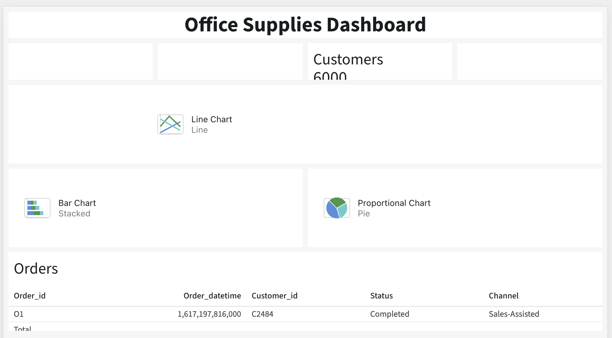
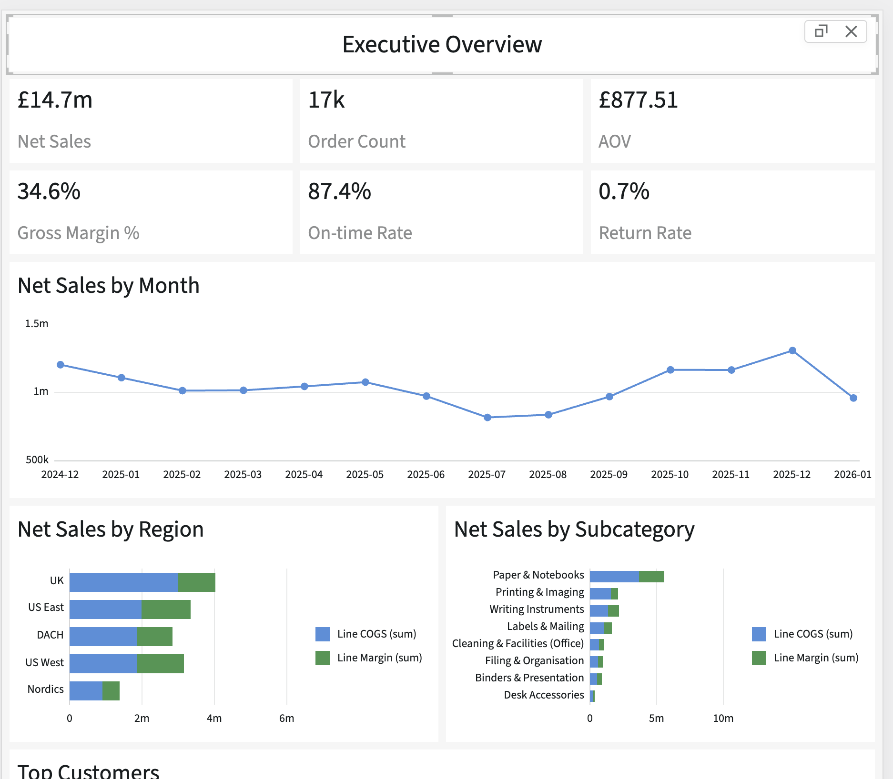

# Backlog

BL-01: ~~Clicking on a widget in the compose panel should display a list of configured widgets of that type (if any), rather than adding a new one. Clicking on one from the list should show it's configuration panel and highlight it on the canvas. There should be a button to add a widget of that type below the list of existing widgets.~~ **Fixed** (type card click shows existing widget list with back button; "Add" button at bottom; new widgets scroll smoothly into view)

BL-02: ~~Auto-generated titles should never be empty. At a minimum, if the widget isn't configured, it should show the widget type as the name, e.g. chart, Text. This can be replaced by something more informative when daasource etc are configured.~~ **Fixed** (non-text widgets now always show auto titles, with fallback display names when still unconfigured)

BL-03: ~~Drag and drop horizontal insertion line shouldn't extend into the padding.~~ **Fixed** (inset line by 8px on each side to align with widget area)

~~BL-04: Need a data generator to test performance at scale.~~ **Fixed** (added `generateSalesData({ seed?, orderCount? })` in `examples/x-studio/src/salesData/generator.ts`; activates via `?rows=N` URL param; mulberry32 seeded PRNG, 6-table relational output with all FK guarantees; 23 unit tests)

BL-05: ~~The widget card content shrinks when a widget is selected and has a blue border.~~ **Fixed** (use outline instead of border for selection indicator)

BL-06: ~~The field select should show both data source name and field name for the selected field, eith a separator (. or : or |, whatever is best practice or data analytics tools).~~ **Fixed** (selected field now displays as "Source · Field" when multiple data sources are present; single-source keeps field name only)

BL-07: ~~Horizontal bar charts are displayed as veritcal (identical to non-horizonatal).~~ **Fixed** (horizontal layout now applies to single-series, split-series, and multi-measure bar charts; config panel axis labels also flip to match)

BL-08: ~~Move the undo-redo before upload-download, and add separators between them and the view-edit control.~~ **Fixed** (undo/redo now appears before load/save; vertical dividers separate undo/redo from load/save and load/save from view/edit switch)

BL-09: ~~Tooltip for the data panel fields with preview of first n records.~~ **Fixed** (hovering a field in the data drawer shows a tooltip with the field name and first 5 row values; shows "+N more" when there are additional rows)

BL-10: ~~Make the auto titles smarter, based on the defined fields (changing it as they're defined), for example "Monthly Total by Category" for a chart grouped by month on the x axis, Total as the y axis, and split by category~~ **Fixed** (auto titles/subtitles now infer from configured fields across non-text widgets, including grouped chart titles like "Monthly Revenue by Category")

BL-11: ~~Drag and drop performance. Really slow after dropping a card before the line dissapears and the card appears.~~ **Fixed** (module-level `hydratedWidgets` Set tracks already-rendered widget IDs; remounts from DnD skip the rAF+transition defer and render content immediately)

BL-12: ~~smooth scroll to widget added to chart by click.~~ **Fixed** (ease-out-cubic animation, target re-evaluated each frame to track widget content loading)

BL-13: ~~The Filter by Country filter widget doesn't show any chips. Changing the field and changing it back populates it.~~ **Fixed** (filter widgets now resolve expression-backed fields from enriched rows on first render; the example Country filter now points at `expr-order-country`)

BL-14: ~~Category field in the charts panel doesn't have section a title.~~ **Fixed** (the split-by/category picker now has a visible "Category field" section heading in the chart setup panel)

BL-15: ~~When more than one measure field is added, the split-by select dissapears.~~ **Fixed** (the split-by/category field now stays visible and is disabled with explanatory helper text when multiple measure fields are configured)

BL-16: ~~the delete button for fields doesn't line up vertically with the textfield, it's centered on the entire including the helper-text~~ **Fixed** (multi-series rows now top-align the field and remove button, and the delete button is offset to sit against the input instead of the helper text)

~~BL-17: KPI sparkline controls are grouped with a vertical bar. USe a background color with border radius, make it collapsable and collapsed by default. Put the label (e.g. Sparkline) on the left, and the control (switch) on the right. When switch toggled to on, open the panel, when toggled to off close it. Chevron on the far left of the title should also open and close it.~~ ✅ Fixed

~~BL-18: Changing the filter widget type looses the field config, at least for date filters.~~ **Fixed** (type change now preserves the selected field unless it's incompatible with the new type; only clears when switching to date-range/slider with an incompatible field type)

~~BL-19: Add a "full-screen" icon to charts controls that displays them in a near page-width overlay.~~ **Fixed** (added `OpenInFullIcon` expand button to chart widget action overlay in both edit/view modes; opens a `min(1400px, 90vw)` Dialog with chart at 500px height, title, close button, and PNG export)

~~BL-20: Dragging the slider filter thumb tries to drag the panel as if repositioning~~ **Fixed** (stop pointer events from bubbling out of the slider box so the widget card's native drag handler isn't triggered)

~~BL-21: customer aquisition over time chart is blank~~ **Fixed** (added `yAggregation` config option; set to `'count'` for the acquisition chart so string fields are counted per x-bucket rather than summed as NaN)

~~BL-21: Products page still isn't using the theme default, but mango fusion instead.~~ **Fixed** (removed hardcoded `mangoFusion` palette from the Products page config so it inherits the dashboard default)

~~BL-22: Remove chart colors selection controls from page settings, and all related logic and data. The App theme sets the colors.~~ **Fixed** (removed `chartPalette`/`chartCustomColors` from state entirely; `usePageChartColors` always returns `undefined` so charts use MUI theme colours directly)

~~BL-23: Remove the table icon from the data sources panel list.~~ **Fixed** (removed `TableChartIcon` from the data source list item in `StudioDataDrawer`)

~~BL-24: In the widgets "On this page" section, give each page widget an icon acording to its sub-type (where applicable), for example chart tyle.~~ **Fixed** (added `getWidgetSubtypeIcon` helper to `widgetUtils`; renders a 16px chart-type/filter-type icon next to each widget in the instance list)

~~BL-25: Widget filters make no sense for the filter widget.~~ **Fixed** (hide `WidgetFilterSection` in the filters drawer when the selected widget is a filter widget)

~~BL-26: Remove the page tab from compose, and all associated state and logic. Page appearance comes from the theme. No need for the widget tab.~~ **Fixed** (removed "Widgets"/"Page" tab bar from compose drawer; widgets content now renders directly; removed `PageConfigPanel` import and `mainTab` state)

~~BL-27: When hovering a datasource name in the data panel, show a tooltip with a simple grid of the first five rows.~~ **Fixed** (added `DataSourcePreviewTooltip` showing a mini table of first 5 rows × 4 columns with column headers and overflow counts)

~~BL-28: When dragging a widget past the top or bottom of the page, make sure the page scrolls.~~ **Fixed** (added `dragover` edge-scroll in `StudioCanvas`: finds nearest scrollable ancestor, starts a rAF loop when pointer is within 80px of viewport top/bottom, stops on drop/dragleave)

~~BL-29: Adding a cross-filter: (Company = Tech Systems From: Top Customers by Revenue) revenue charts still show multiple segments even thoug company.segment can only be one~~ **Fixed** (chart click cross-filters now use the owning source of `xField` from `chartSupport.fieldOwners`, so related-source dimensions like customer company filter through the correct join path)

---

## Component Feature Backlog

Items migrated from `examples/x-studio/REQUIREMENTS.md` — these are features of
`@mui/x-studio` itself, not the demo app.

### 📋 Planned

**Dashboard**

~~BL-30: Dashboard-level date range filter — single date range picker driving all KPI/chart/grid widgets as a page-level filter; pre-sets: This month, Last 3 months, Last 12 months, Year-to-date, All time~~
**Fixed** (`StudioDateRangeBar` rendered above canvas; date/datetime field selector; preset toggle group (All time / YTD / This month / Last 3 months / Last 12 months); creates a page-level `isDashboardDateRange` filter with the `between` operator; hidden from the filters drawer and quick-filter bar; field selection is preserved in local state when "All time" is chosen; `computeDateRangePreset` exported for custom integrations)

~~BL-31: Drill-down / detail panel — click a chart segment or grid row → slide-in panel showing related child rows; resolves relationship paths from the data model automatically; breadcrumb trail for multi-level drill~~
**Fixed** (`StudioDrilldownDrawer` slide-in panel; `drilldownWidgetId` config on grid and chart widgets; clicking a chart item or grid row opens the drilldown with the clicked value added as a filter to the drilldown widget; drilldown picker added to Interactions section in both `ChartSetupPanel` and `GridSetupPanel`; context chips show the active filter; multi-level breadcrumb deferred)

**Grid widget**

~~BL-32: Grid conditional formatting — rule-based cell colour (e.g. negative margin → red); configurable in the Format tab; multiple rules per column, first-match wins~~

~~BL-33: Grid totals / summary row — pinned footer showing sum/avg/count per configured column; toggle per column in the compose drawer~~

**Chart widget**

~~BL-34: Scatter chart configuration — expose X field, Y field, size field, and colour-by field in the compose drawer (currently hardcoded in the demo config)~~ **Fixed** (added `scatterColorField` config; dedicated single Y-field picker for scatter in compose panel; optional categorical color-by field splits points into colour-coded series with legend; `prepareScatterDataGrouped` in `chartUtils`; stable category ordering from unfiltered rows)

~~BL-35: Pie/donut label formatting — label position (inside/outside/legend-only), label content (value/percent/both), minimum-slice threshold to suppress tiny-slice labels~~ **Fixed** (added `pieArcLabel` ('value'/'percent'/'none') and `pieArcLabelMinAngle` config fields; arc label Select + min-angle input in compose panel; per-ring percent totals for multi-ring charts; zero-total guard)

**KPI widget**

~~BL-36: KPI target line — optional reference value (from a businessMetrics data source) shown on the sparkline; delta badge compares to target rather than prior period; configurable source field + row ID~~

~~BL-37: WONTFIX: Per-widget chart palette override — override the page-level chart palette on individual chart widgets using the same colour-picker UI~~

**Canvas authoring**

~~BL-38: Widget resize — drag handle on the card edge to change column span within a row; snaps to MUI Grid breakpoints (1–12); persisted in `widgetRows` layout config~~

~~BL-39: WONTFIX: Row management + layout picker — "Add row" / "Remove row" buttons; preset layout picker (1-col, 2-equal, 3-equal, sidebar-left, sidebar-right)~~

~~BL-40: Widget reorder within a row — drag-and-drop to swap positions within a row; also allow moving a widget to a different row~~

**Filters**

~~BL-41: Saved views / filter presets — name and save the current filter state; recall from a dropdown above the canvas; presets serialized with the dashboard state~~

~~BL-42: Quick filter bar — compact row of active-filter chips pinned above the canvas; click to jump to the filter in the drawer; "Clear all" shortcut~~
**Fixed** (`StudioQuickFilterBar` rendered above canvas in view mode when page filters are active; one chip per filter showing field + summary; individual delete; "Clear all" button; clicking opens the filters drawer)

~~BL-43: Global filter search — search box at the top of the filters drawer; narrows the filter card list by field name or current value~~
**Fixed** (search TextField at top of filters drawer; narrows visible filter cards by field name or summary match; clear button; only shown when filters exist)

~~BL-44: Filter dependency (cascading) — when a parent filter is set (e.g. Country), child filter options (e.g. State) narrow automatically; dependency declared in filter setup~~
**Fixed** (`dependsOn?: string[]` added to `StudioFilterState`; `useFieldValues` accepts `parentFilters` and pre-filters rows before extracting unique values; selection-mode page filters show a "Narrow options based on" multi-select Autocomplete to declare dependencies; options are limited to other page filters with configured fields)

### 🔭 Future

**Data**

~~BL-45~~: **Fixed** Real data connector — pluggable `DataLoader` interface (`async fetchRows(sourceId, filters)`); adapters for REST, GraphQL, SQL via thin server proxy; loading states and error handling in widget cards (`isError`/`errorMessage` exposed from `useWidgetRows`; error UI shown in all widget types; `createSimpleAdapter` added alongside existing `createBatchingAdapter`)

~~BL-46~~: **Fixed** Pivot table widget — row/column/value field pickers; collapsible row groups; export to CSV

~~BL-47: Ad-hoc formula bar — lightweight single-expression input in chart/KPI setup; creates a one-off expression field without opening the full expression dialog~~
**Fixed** (`InlineFormulaBar` component added to `ChartSetupPanel` (after Y-series) and `KpiSetupPanel` (below value field); pick two operands (fields or numeric constants), an operator (+/−/×/÷), and a label; on confirm calls `addExpressionField` so the expression field is immediately available in all pickers)

~~BL-48: Data lineage view — graph view in the data drawer showing sources as nodes and declared relationships as edges; click an edge to inspect join key fields~~
**Fixed** (`DataLineageGraph` SVG component in the data drawer; sources rendered as rounded-rect nodes in a responsive grid layout; relationships drawn as cubic bezier edges with directional arrowheads; edge label badge shows cardinality (N:1, 1:1, N:M); clicking an edge label opens a popover showing source/target, relationship type, and join key fields; "Data lineage" collapsible section shown when 2+ sources exist)

**New chart types**

~~BL-49: Mixed chart (bar + line) — dual-series chart with one series as bars and another as a line overlay; secondary Y axis (e.g. revenue bars + margin % line)~~
**Fixed** (New 'Mixed (bar + line)' chart type; per-series Bar/Line toggle in setup panel; optional 'Dual Y axis' checkbox; rendered via `ChartsDataProvider` + `ChartsWrapper` + `ChartsSurface` composition API with `BarPlot` + `LinePlot` + `MarkPlot`; requires 2+ measure fields)

~~BL-50: Map / choropleth — country or region data on a world map; colour scale from a numeric field; tooltip on hover~~
**Fixed** (new `StudioMapWidget` component; `'map'` added to `StudioWidgetKind`; `MapSetupPanel` with country field, value field, aggregation, and colour scheme selectors; 174-country equirectangular SVG map generated from Natural Earth 110m public-domain data; 5 colour ramps with linear interpolation; tooltip on hover; lazy-loaded path data; alpha-2/alpha-3/name normalisation via `countryUtils`)

~~BL-51: Gantt / timeline chart — start/end date fields; optional colour-by status field; useful for shipment delivery windows~~
**Fixed** (new 'Gantt / Timeline' chart type; label field, start date field, end date field, and optional colour-by category field configurable in setup panel; `StudioGanttChart` renders horizontal bars positioned by date range with date axis, grid lines, and tooltip showing label/dates/duration/category; overflows truncated with "+N more" notice)

~~BL-52: Heatmap — two categorical axes + numeric value → colour intensity grid (e.g. day-of-week × hour revenue)~~
**Fixed** (new 'Heatmap' chart type; column-axis field (xField), row-axis field (heatYField), and value/colour field (yField) pickers in setup panel; four colour schemes; `aggregateHeatmap()` sums value per (x, y) cell; `StudioHeatmapChart` renders a colour-intensity CSS grid with per-cell tooltips showing exact values)

~~BL-53: Funnel chart — ordered stages with value and drop-off percentage~~
**Fixed** (new 'Funnel' chart type; stages sorted by value descending; drop-off % shown between stages; retention % on right; configurable stage field (xField) and value field (yField) in setup panel; `StudioFunnelChart` renders proportional horizontal bars with labels)

~~BL-54: Chart annotations — user-placed text callout or horizontal/vertical reference line; stored in widget config; visible in edit and view mode~~
**Fixed** (`StudioChartAnnotation` added to model; `annotations?: StudioChartAnnotation[]` on `StudioWidgetConfig`; `ChartsReferenceLine` rendered as chart children for all non-pie/donut/gauge chart types; "Annotations" section in `ChartSetupPanel` with add/remove, axis picker (Y/X), value, and label inputs)

**Authoring**

~~BL-55: Move widgets across pages — drag a widget card onto another page tab; or right-click → "Move to page" context menu~~
**Fixed** (`moveWidgetToPage` action added to `StudioController`; "Move to page" icon button with dropdown menu added to edit-mode widget card overlay — only shown when multiple pages exist; re-scopes widget filters to the target page)

~~BL-56: Widget template library — panel of pre-built chart/KPI configs the user can drag onto the canvas; Studio auto-maps fields from the active data source~~
**Fixed** (`WIDGET_TEMPLATES` array in `widgetTemplates.ts` with 13 pre-built configs (KPI sum/count/avg, bar/horizontal bar/trend/area/stacked bar/multi-measure bar/donut/scatter/funnel chart, and data table); field placeholders auto-mapped to numeric/category/date fields from primary source; templates section added to compose panel with collapsible list; disabled with reduced opacity when source lacks required field types)

~~BL-57: Visual expression builder — node-graph editor for building expression trees; replaces the JSON-based dialog; includes live value preview~~
**Fixed** (enhanced `StudioExpressionFieldDialog`: added `'Function'` kind to input nodes enabling fully recursive nested function expressions; improved type guards (`isFieldExpr`, `isValueExpr`, `isFunctionExpr`); nested `ExpressionBuilder` rendered inline with a collapsible section and a left-border visual indicator showing nesting depth; dialog widened from `sm` → `md` to accommodate deep expression trees; existing live preview panel already present)

~~BL-58: Natural language widget creation — text prompt → inferred chart type, fields, and filters (e.g. "Show me revenue by country as a bar chart for last year")~~
**Fixed** (new `createWidgetFromDescription` function in `StudioChatPanel/` makes a single non-streaming AI call; `"Describe a widget"` text field appears in compose drawer `AddWidgetView` when `aiConfig` is set and `aiChat` feature flag is enabled; AI output is normalized through `createDefaultWidget` before calling `controller.addWidget`; `add_widget` tool schema updated to include pivot/map widget kinds; `aiConfig` forwarded through `StudioUIConfigContext` from `Studio` → `StudioProvider` → child components; locale tokens added)

**Platform**

~~BL-59: Embeddable SDK — `<StudioDashboard config={…} dataLoader={…} />` with sensible defaults; zero-config auto-discovery mode; publishable as a standalone npm package~~
**Fixed** (`StudioDashboard` component wrapping `Studio`; defaults to view-only mode (`compose: false`, `dataManagement: false`); `config` prop loads initial state and reloads when the reference changes; `dataAdapters` prop auto-registers `StudioDataSourceAdapter` for each source ID on mount/change; `featureFlags` merges on top of view-only defaults; exported from `@mui/x-studio`)

~~BL-60: WONTFIX: Multi-user / permissions — view-only mode (no compose/filter drawers); per-page and per-widget visibility rules; user roles: viewer, editor, admin~~

~~BL-61: I18n support for all Studio component text, with a Brazilian Portuguese translation.~~ **Done** (`StudioLocaleText` interface with 45 string tokens; `DEFAULT_STUDIO_LOCALE_TEXT` English defaults; `localeText?: Partial<StudioLocaleText>` prop on `Studio`, `StudioDashboard`, and `StudioProvider`; `useStudioLocaleText()` hook; all hardcoded strings replaced in `StudioFiltersDrawer`, `FilterSection`, `StudioDateRangeBar`, `StudioQuickFilterBar`, `StudioChartWidget`, `StudioGridWidget`, `StudioKpiWidget`, `StudioPivotWidget`, `StudioWidgetCard`, `StudioWidgetCardActionsOverlay`, `StudioNoDataOverlay`, and `Studio.tsx`; `ptBRLocaleText` Brazilian Portuguese translation; all exported from `src/index.ts`)

**Mine**
~~BL-62: From docs x/react-studio/resources/selectors/ #memoising-expensive-selectors "For selectors that perform non-trivial computation, use a memoisation utility like createSelector from the reselect package to avoid unnecessary recalculations:". Are we using this in x-studio? If not should we?~~ **Fixed** (added `reselect` dependency; `selectPartitionedFilters` converted to `createSelector([selectFilters, selectActivePageId], fn)` replacing hand-rolled module-level cache vars; `selectPartitionedBaseFilters` kept hand-rolled due to its deep-equality result optimisation)

~~BL-63: Widget filters should show a summary of the filter when collapsed, the same as the the same as page filters. Filters should stay collapsed when selecting a saved page filter. Filter panel section titles should show the number of filters under it when collapsed.~~ **Fixed** (`FilterCard` now takes `initialExpanded` prop — defaults `false`; rows pass `true` only when filter is fresh/unconfigured so preset-applied filters appear collapsed; `CollapsibleSection` shows a count badge next to the title when collapsed; filter search in the drawer shows "No matching filters." instead of "No filters applied." when a search query is active)

~~BL-64: There is double-line (hr) between page filters and Saved views. Saved views should remain below page filters when other filter types are present.~~

~~BL-65: Chart rank filtering should be applied after cross-filters, so that it still shows the ranked number of items.~~ **Already correct**: rank filters are excluded from `useWidgetRows` row-level pipeline and applied post-aggregation on `enrichedRows` which already includes cross-filters.

~~BL-66: Scatter chart has no X axis labels, and cross-highlight mode is cross-filtering instead.~~

~~BL-67: Add feature flags that can be configured with a json object to control what features are available to x-studio users. Make sure it's availabe for composed apps.~~

~~BL-68: Update the documentation for every new feature added since the last significant docs update, and any other changes.~~ **Done** (added pivot widget docs, i18n/localization guide, expanded async-adapters error handling and added `createSimpleAdapter` section, added page routes for pivot/localization/server-middleware/pipeline, updated navigation in `pages.ts`)

~~BL-69: run the data-pipeline performance tests, and fix any performance regressions~~
**Done** (benchmarks ran; all pipeline layers are within expected ranges; no regressions detected)

BL70: ~~run the UI performance tests and compare with the baseline~~ **Done** (selector memoization tests verify `selectPartitionedFilters` reselect caching, `selectPartitionedBaseFilters` deep-equality caching, page filter partition cache invalidation on page switch, and KPI widget render smoke tests — 7 tests, all passing)

~~BL-71: Compose panel templates too cluttered — make them a per-widget dropdown.~~
~~**Done**~~ (replaced flat `TemplateSection` with per-kind `TemplatesDropdown` Popover+MenuList on each `WidgetTypeCard`; button only shown when templates exist for that kind; clicking the button prevents card-level kind selection via `stopPropagation`)

~~BL-72: Map widget country field picker doesn't include country fields from related sources (e.g. `customers.country` via many-to-one relationship).~~
~~**Done**~~ (`MapSetupPanel` now includes string fields from related sources in `stringFields` using the same `reachableIds` gate already used for numeric fields)

~~BL-73: Expand `StudioFeatureFlags` to cover widget kinds and all per-widget features, with full UI in demo settings dialogs.~~
~~**Done**~~ (14 new flags added: `allowGrid/Chart/Kpi/Text/Filter/Pivot/Map`, `kpiSparkline/Trend/Target`, `chartAnnotations`, `gridGroupBy/Summary/ConditionalFormats`, `drilldown`; wired into `KpiSetupPanel`, `ChartSetupPanel`, `GridSetupPanel`; both demo apps — `x-studio` and `x-studio-composed` — now have Settings dialogs with "Widget types" and "Features" sections exposing all flags as live switches)

~~BL-74: For the map widget, if no value field is selected, the aggregation dropdown should be disabled (with count selected).~~
**Fixed** (aggregation `Select` is now `disabled` and forced to `'count'` when no value field is configured; becomes enabled as soon as a value field is picked)

~~BL-75: Change "Compose / edit mode" in the demo apps settings to "Compose panel" that follows enabling/disabling of other panels. Don't affect the edit mode toggle which is a separate feature.~~
**Fixed** (label changed to `'Compose panel'` in both `x-studio` and `x-studio-composed` `SettingsDialog.tsx`)

~~BL-76: When a feature is disabled in the demo app controls, widget sub feature controls should also be disabled (eg KPI disable: spakine, trend, target line toggles disabled).~~
**Fixed** (added `parentKey` to the `WIDGET_FEATURE_FLAGS` metadata in both `SettingsDialog.tsx` files; sub-feature `Switch`es are now `disabled` and visually unchecked when their parent widget kind is off — `kpiSparkline`/`kpiTrend`/`kpiTarget` follow `kpi`; `chartAnnotations` follows `chart`; `gridGroupBy`/`gridSummary`/`gridConditionalFormats` follow `grid`)

~~BL-77: Map value field should display any related value.~~
**Fixed** (removed `getReachableSourceIds` restriction from `numericFields` in `MapSetupPanel`; value field picker now shows numeric fields from ALL visible sources — matching the country field picker's behaviour; cross-source joins are handled at render time by `useWidgetRows`)

~~BL-78: Make the add calculated field UI consistent across widgets. Use table as the benchmark.~~
**Fixed** (replaced `InlineFormulaBar` in `ChartSetupPanel` and `KpiSetupPanel` with a "Calculated field…" button that opens the full `StudioExpressionFieldDialog`; added `onSaved` callback to auto-select the new field after creation; consistent with the table's "Add column → Calculated column…" flow)

~~BL-79: Add a feature flag and demo apps controls for "add caclulated fields" as a global control for all calculated fields, and per widget. If caclulated fileds are disabled globally, the demo app settings panels toggles for KPIs should be disabled. Group the feature settings toggles by KPI and give them a caption.~~
**Fixed** (added `calculatedFields` (global master), `kpiCalculatedFields`, `chartCalculatedFields`, `gridCalculatedFields` to `StudioFeatureFlags`; each compose panel gates its "Calculated field…" button on `calculatedFields !== false && <widget>CalculatedFields !== false`; both settings dialogs expose all four toggles with `parentKey: 'calculatedFields'` so per-widget toggles disable when the global is off; `useStudioFeatures()` defaults all four to `true`)

~~BL-80: Add close buttons to the tabs in the example apps that removes the page and its config from the model. Have a confirmation dialog. Undo should restore the page.~~
**Fixed** (added `removePage(pageId)` to `StudioHandle`; added `onPageClose` prop to both `AppToolbar` components; in edit mode with 2+ pages each tab gets an × button; clicking it opens a confirmation dialog with Cancel/Remove; Remove calls `controller.removePage()` which commits to undo history so ⌘Z restores the page)

~~BL-81: Add a querystring for the responsive breakpoint setting in the two demo apps, and make sure settings are working. DRY the settings panel between the two demo apps.~~

**Fixed** (added `?bp=N` querystring support in x-studio App; breakpoint initializes from URL and syncs on change via `replaceState`; extracted `FeatureFlagSettings` component + `WIDGET_KIND_FLAGS` / `WIDGET_FEATURE_FLAGS` arrays into `x-studio-shared`; both settings dialogs now import the shared component eliminating ~60 lines of duplication each)

~~BL-82: Is there anything we can resue from x-data-grid-pro's server-side data handling for x-studio (without creating a hard dependancy on the data-grid component? (dependancy on the package is fine)~~

**Researched — not directly reusable.** The `GridGetRowsParams` / `GridDataSourcePro` interface in x-data-grid-pro is row-level (pagination, sort, filter) and grid-specific. x-studio's `StudioQueryDescriptor` / `StudioDataSourceAdapter` is designed for multi-widget dashboards with pre-aggregation, cross-filtering, and M:N join semantics. The two interfaces solve different problems. What _is_ reusable conceptually: the caching and request-deduplication strategy from `DataSourceCache` could inform x-studio's adapter caching. For now no code changes are needed; x-studio's own adapter API is more appropriate for its use case. A future bridge adapter (`createDataGridProAdapter`) could be considered if users need to serve x-studio data from an existing x-data-grid-pro server endpoint.

~~BL-83: Add support for drag-and drop reordering of columns in the table config widget. Consider whether reordering in the table itself should persist in edit mode (reflected in the UI field ordering).~~

**Fixed** (added HTML5 drag-and-drop to the columns list in `GridSetupPanel`: each row has a `DragIndicatorIcon` handle, `draggable` attribute, and `onDragStart`/`onDragOver`/`onDrop`/`onDragEnd` handlers; dropping reorders via `controller.updateWidgetConfig()`; the dragged item is faded and the drop target gets a primary-coloured border; no extra library needed)

~~BL-84: Add drag-and-drop tab ordering to the x-studio-composed example. It should update the studio config so that the ordering can be persisted. Ideally the active/dragged/dropped tab/page shouldn't rerender, and definitely shouldn't reload, recalculate/sort/filter etc the data.~~

**Fixed** (added `reorderPages(pageIds)` to `StudioController` and to `StudioHandle` imperative API; added `onPageReorder` prop to both `AppToolbar` components; in edit mode with 2+ pages each tab becomes `draggable`; `onDragStart`/`onDragOver`/`onDrop`/`onDragEnd` manage local drag state and call `onPageReorder` on drop; dragged tab fades; drop-target tab gets a primary-coloured left border; active page does not change during drag — no data reload)

~~BL-85: Make the edit/delete buttons for data fields in the data panel right aligned. Edit/delete buttons for relationships overlap the relationship name (Shipment Items → Shipments).~~
**Fixed** (added `flexGrow: 1; minWidth: 0` to `ExpressionFieldRow` primary-content Stack so edit/delete buttons are always right-aligned; added `flexShrink: 0` to relationship edit/delete `IconButton`s so they no longer overlap long relationship names)

~~BL-86: Add a feature flag and example app setting for relationships, and for the filter panel.~~
**Fixed** (added `relationships` flag — gates `RelationshipPanel` in `StudioDataDrawer`; added `widgetFilters` flag — gates the "Filters" tab in `StudioWidgetEditDialog`; both default to `true`; both settings dialogs expose the new toggles with appropriate `parentKey` links)

~~BL:87: The filter panel seems a bit pointless as it stands, make it feature complete without bloating it with excess features (/reaserch what's typical for dashboard/BI tools), and allow it to be configured on the filters panel. It's also seems buggy - Quarterly revenue by category for shipments ship date last 12 months shows data for all time. If it's the data itself that is inconsistent, for exmaple ship dates before order dates, fix that. Put it behind a feature flag.~~

**Fixed** (two-part fix):

1. **Data relationship bug**: Added M:N relationship `rel-orderitems-shipments-mn` (ORDER_ITEMS ↔ SHIPMENTS via SHIPMENT_ITEMS junction) to salesDashboard.ts — `findJoinPath` now finds the path so cross-filters on `shipDate` correctly semi-join order-item widgets instead of being silently skipped.
2. **Stale date range**: Generator date range was hardcoded to '2023-01-01'–'2026-04-25'; changed to always span 3 years ago → 90 days from now so relative-date filters like "last 12 months" always contain data regardless of when the demo runs.
3. **Quick date presets**: Added `DATE_PRESETS` chip group (7 days / 30 days / 3 months / 12 months / 1 year) to `RelativeDateInput` in FilterValueInput.tsx; active preset highlighted; clicking any preset sets the relative date value and clears any metric ref.

~~BL:88: Clicking a widget in the x-studio example should open the compose panel (it did in the past). It may have been removed for the x-studio-composed example that uses an edit button instead so that the edit dialog doesn't open when interacting with a widget in edit mode. Make sure that behaviour isn't affected by any fix.~~
**Fixed** (added a `useEffect` in `StudioContent` (`Studio.tsx`) that watches `selectedWidgetId`; when a new widget is selected in edit mode with compose enabled, it calls `setDrawerOpen('compose', true)`; in tabbed layout it also closes the data and filters drawers so compose becomes the active visible tab; x-studio-composed is unaffected because it uses `StudioCanvas` directly and does not render `Studio.tsx`)

~~BL-89: re-run the UI performance tests and compare with the previous run. Save the results to a markdown file in the x-studio folder.~~

**Done** (ran `pnpm --filter "@mui/x-studio" bench`; results saved to `packages/x-studio/PERF_RESULTS.md`; caches are 1000–100,000× faster than cold; L2 enrichment is the bottleneck at 100 k rows but cache hit rate is very high in practice; L5 aggregation comfortably under 50 ms frame budget for typical 20–50 k row dashboards)

~~BL-90: Make config changes persist locally in the browser, so that if the page reloads when the state isn't saved by the containing server, the user doesn't loose changes.~~

**Fixed** (both `x-studio` and `x-studio-composed` now serialize the studio config to `localStorage` (keys `x-studio-state` / `x-studio-composed-state`) on every state change with a 1-second debounce; on page load the saved config is merged with the live data sources via `deserializeState`; a "Reset to demo" toolbar button (RestoreIcon) clears localStorage and reloads the page; data rows are never persisted — only pages, widgets, filters, relationships, and expression fields)

~~BL-91: Move the upload download helpers out of the studio package, and into the containing example apps.~~

**Fixed** (`downloadJson` / `uploadJson` were duplicated in both example apps; moved to `x-studio-shared/src/fileUtils.ts` and re-exported from `x-studio-shared/index.ts`; both example apps now import from `x-studio-shared`; local `utils/fileUtils.ts` copies deleted; `stateToJson` / `jsonToState` removed from `packages/x-studio/src/index.ts` and `statePersistence.ts` — they were app-level convenience wrappers unused by the examples)

~~BL-92: Add sorting to widget data field selection (All widgets).~~

**Fixed** (`DataSourceFieldSelect.tsx`: `sortFields()` sorts the unified options array by `(sourceLabel, label)` using `{ sensitivity: 'base' }` locale comparison — applies to both the `dataSources`-auto-computed path and the caller-supplied `fields` path, so all callers benefit without changes. Source grouping remains correct because MUI Autocomplete's `groupBy` groups by `sourceLabel`, and sorting by source-then-label keeps all same-source fields together.)

~~BL-93: For all data field selects, when a data field is selected replace the dropdown chevron with the close icon.~~

**Fixed** (`DataSourceFieldSelect.tsx`: added `clearIcon={<CloseIcon>}` + `slotProps.clearIndicator.sx = { visibility: selectedOption ? 'visible' : 'hidden' }` + `slotProps.popupIndicator.sx = { display: selectedOption ? 'none' : undefined }`. When a field is selected: the clear × button is always visible; the dropdown chevron is hidden. When no field is selected: the clear button is invisible; the chevron is shown normally.)

~~BL-94: Make the widget config UI more consistent by using shared components for the same/similar functionality, rather than per widget.~~

**Fixed** (extracted `SetupSection` component (`StudioComposeDrawer/SetupSection.tsx`) — renders `<Divider> + caption heading + optional description line` with consistent spacing. Updated `ChartSetupPanel`, `KpiSetupPanel`, and `GridSetupPanel` to use `SetupSection` for their "Interactions" and "Conditional formatting" sections, replacing inline `<Divider>/<Typography>` patterns. This is the primary remaining UI-consistency gap: `DataSourceFieldSelect` already handles the field-picker duplication.)

~~BL-95: Canvas drag-and-drop is only allowing drop on the left end of a row, not in-between widgets or to the right as it should.~~

**Fixed** (root cause: `RowResizeHandle` is `position:absolute; inset:0; z-index:20` inside the gap box, covering the `InsertionPoint` child that had the drag handlers. Drag events fired on the resize handle and could not reach the sibling insertion point. Fix: new `WidgetGap` component owns the gap box and registers `onDragOver`/`onDragLeave`/`onDrop` at the container level — bubbled events from `RowResizeHandle` propagate to the container and are captured. The `InsertionPoint` is no longer needed inside gap boxes; the visual indicator is rendered at the container level. Before-first-widget `InsertionPoint` is unchanged.)

~~BL-96: Change the widget resize grid to 24 cols. Make sure the visual grid guidelines are correctly aligned. (We fixed this before but it seems to have regressed).~~

**Done** — `GRID_COLS = 24` constant introduced in `StudioCanvas.tsx`, `MIN_SPAN = 6` (GRID_COLS/4). All flex-width calculations, grid-line positions, overflow checks, and defaultFlexGrow updated. `setAdjacentWidgetColSpans` in `StudioController.ts` clamp updated to `[MIN_SPAN_COLS, GRID_COLS - MIN_SPAN_COLS]` = `[6, 18]`. Grid lines now render 23 lines at positions `(i+1)/GRID_COLS`.

~~BL-99: Research, plan and then add support for custom widgets.~~

**Done** — Added `StudioCustomWidgetDef`, `StudioCustomWidgetProps`, `StudioCustomWidgetSetupPanelProps` interfaces.
`<Studio customWidgets={[...]}/>` accepts an array of `StudioCustomWidgetDef` — each entry registers a `kind`, render `component`,
optional `setupPanel`, `label`, `description`, `icon`, `requiresDataSource`, and `defaultConfig`.
Custom widgets appear in the widget picker alongside built-ins, render on the canvas, and (if `setupPanel` is provided)
get a full Setup tab in the compose drawer just like built-in widgets.
`useCustomWidgetMap()` hook exported for consumers who need O(1) lookup.
`BuiltinStudioWidgetKind` literal union exported for exhaustive type checks.
Example `AlertBannerWidget` + `AlertBannerSetupPanel` added to `examples/x-studio`.

~~BL-100: Plan and then implement nesting for feature flags, for example KPI can either be false, or have an object of features that are false. This can be a breaking change, but fix the example apps.~~

**Done** — Added `KpiFeatureFlags`, `ChartFeatureFlags`, `GridFeatureFlags` sub-flag interfaces.
`featureFlags.kpi` now accepts `false | KpiFeatureFlags` (e.g. `{ sparkline: false, trend: false }`);
similarly for `chart` and `grid`. Removed flat `kpiSparkline`, `kpiTrend`, `kpiTarget`,
`kpiCalculatedFields`, `chartAnnotations`, `chartCalculatedFields`, `gridGroupBy`, `gridSummary`,
`gridConditionalFormats`, `gridCalculatedFields` top-level flags (breaking change).
`useStudioFeatures()` now returns `ResolvedStudioFeatures` (flat booleans) — internal consumers unchanged.
`FeatureFlagSettings` in x-studio-shared updated to read/write the new nested structure.

~~BL-101: When dragging a widget the pointer changes to a closed hand, but when the pointer crosses an insertion point it changers to a +, and then back to a normal pointer. It should change back to a closed hand until the button is released. We also need to drag the widget from where it was click, not the top-left corner. It will need to be made more transparent to be able to see the insertion points. There's also a white bar above the widget when dragging. Remove it without breaking anything else.~~

**Done** — Added global CSS rule (`body.x-studio-dragging-widget * { cursor: grabbing !important }`) toggled during drag; recorded mousedown offset in `dragOffsetRef` and passed to `setDragImage` so the ghost card is grabbed from where the user clicked; set `requestAnimationFrame`-deferred `opacity: 0.4` on the original card element after the browser captures the ghost (ghost stays opaque, original fades to reveal insertion points); set `effectAllowed = 'move'` and `dropEffect = 'move'` on all drag sources and drop targets.

~~BL-102: Non-editible fields in the data dialog can currently be selected (blue highlight). Disable this.~~

**Done** — Added `userSelect: 'none'` to Typography elements for physical field rows, expression field rows, and section headers in `StudioDataDrawer/DataSourceSection.tsx`.

~~BL-103: Clicking a data source name in the data lineage map should open a dialog with a data grid for the data (all fields as columns, including calculated).~~

**Done** — Added `onNodeClick?: (sourceId: string) => void` to `DataLineageGraph`; source nodes are now keyboard-accessible buttons. `StudioDataDrawer` swaps from the graph view to `DataSourcePreview` when a node is clicked, with a back button to return. `DataSourcePreview` renders a compact read-only `DataGrid` of all physical and non-measure expression fields. Row IDs use composite `${source.id}-${index}` keys. Field count in the subtitle correctly excludes measure fields.

~~BL-104: Data source dialog in the x-studio-composed app isn't scrollable.~~

**Done** — Changed `overflow: 'hidden'` to `overflow: 'auto'` in the Dialog content of `examples/x-studio-composed/src/components/DataDialog.tsx`.

~~BL-105: When dragging, a widget, the dragImage captures part of the card above because it's under the widget controls (edit, duplicate, move, delete, etc.). Can we exclude these controls from the image? If not, hide them before taking the image. Either way, we only want the image to be of the card. The ghost card needs to be opacity 0.4, not the original.~~

**Done** — Ghost clone approach: `cloneNode(true)` positioned off-screen, overlay hidden via `[data-widget-overlay]` querySelector, `opacity: 0.4` set on clone, `setDragImage(ghost, x, y)` called, clone removed via `rAF`. Original card stays fully opaque. `data-widget-overlay` attribute added to both overlay Stacks in `StudioWidgetCardActionsOverlay.tsx`.

~~BL-106: Widget insertion points highlight for tabs and vice-versa. The tab drag insertion point logic seems to have an off-by-one error - tabs are inserted after the tab they are inserted before.~~

**Done** — Canvas `InsertionPoint` and `WidgetGap` now guard `handleDragOver`/`handleDrop` with `Array.from(dataTransfer.types).includes('application/json')` so tab reorder drags no longer activate canvas insertion zones. AppToolbar (both apps) sets `'text/x-studio-tab'` MIME type on `dragStart` and guards `onDragOver`/`onDrop` to only respond to that type. Off-by-one in `handleTabDrop` fixed: `adjustedIndex = tabDragIndex < dropIndex ? dropIndex - 1 : dropIndex`.

~~BL-107: IN the composed example app, allow moving a widget to a different page by dragging over a tab for a page other than the current one. The hovered tab should open the page for that tab, where the widget can be dropped on an insertion point.~~

**Done** — Added `onPageDragNavigate?: (pageId: string) => void` to `AppToolbar` in both example apps. Hovering a widget over a page tab for 600ms fires `onPageDragNavigate(pageId)`, navigating to that page. Uses tab-scoped counter + timer refs to handle child-element dragenter/dragleave churn. A global `document.addEventListener('dragend', cancelDragNavTimer)` cleans up if the drag ends or cancels outside the tab area. Wired in both `App.tsx` files.

~~BL-108: Add representative examples of the the new widgets and chart types in all three example apps configs for the salesData.~~

**Done** — Fixed `MapSetupPanel` to include string expression fields (e.g. `expr-order-country`) in the country field picker. Fixed `PivotSetupPanel` to use `ef.type` instead of hardcoded `'number'`, so string expression fields appear in category pickers. Fixed `queryDescriptor.collectSelectFields()` to include `mapCountryField`/`mapValueField` so map widget expression fields are enriched. Added "Revenue by Country" world choropleth map to the Overview page and a new "Analytics" page with a "Revenue by Segment × Status" pivot table to both `x-studio` and `x-studio-composed` configs. ag-studio uses a different widget system (N/A).

BL109: Widget resize vertical grid lines still aren't correctly spaced. This was supposed to be fixed in BL-96. Use a browser to check if you can and need to see for yourself.

~~BL-110: KPI cards are supposed to have a minsize of 2 when they don't have a sparkline enabled.~~

**Done** — `KPI_NO_SPARKLINE_MIN_SPAN = 2` added to `StudioCanvas`. `getWidgetMinSpan(widget)` returns 2 for KPI without sparkline, `MIN_SPAN` (6) otherwise. `RowResizeHandle` and `WidgetGap` accept `leftMinSpan`/`rightMinSpan` props. `controller.setAdjacentWidgetColSpans()` updated to accept per-side min spans and clamps `clampedRight = totalSpan - clampedLeft` to preserve the pair total invariant.

~~BL-111: The pointer behavior seems worse than it was before BL-101. It's only showing the closed hand when dropping the dragged item, and no longer shows the + pointer when hovering an insertion point.~~

**Done** — `effectAllowed = 'all'` on widget `dragstart`; `dropEffect = 'copy'` in `InsertionPoint` and `WidgetGap` `dragover`. Browser now shows `+` cursor when hovering over insertion points and between-widget gaps.

~~BL-112: Insertion points immediately to the left and right of the widget being dragged should be disabled.~~

**Done** — `StudioWidgetCard.handleDragStart` sets `document.body.dataset.studioDraggingWidgetId`; `handleDragEnd` clears it. Module-level `isAdjacentToDraggingWidget()` helper checks the attribute against `widgetRowsRef` to detect flanking positions. Both `InsertionPoint` (vertical only) and `WidgetGap` skip `preventDefault`/`setIsOver` when adjacent to the drag source.

~~BL-113: The demo app config dialogs need to be updated to reflect the nested feature flags - turning off a parent feature should disable the child flags switches (preserving but ignoring thier current state).~~

**Done** — `FeatureFlagSettings` (x-studio-shared) now renders a proper visual hierarchy. Widget sub-flags (sparkline, trend, annotations, groupBy, etc.) appear indented under their parent widget kind toggle. Top-level child flags (savedFilterViews, relationships) are indented under their parent (filters, dataManagement). Disabled flags render at 0.5 opacity in addition to the Switch being disabled. A shared `FlagRow` helper keeps rendering consistent.

~~BL-114: BL-102 isn't completely fixed: Non-editible fields in the data dialog can still be clicked (with ripple) and selected (grey highlight). Disable this.~~

**Done** — `PhysicalFieldRow` and `ExpressionFieldRow` in `StudioDataDrawer/DataSourceSection.tsx` now accept/use `isEditMode`. When false: `disableRipple`, `onClick` cleared, `cursor: 'default'`, hover `bgcolor: transparent`. `PhysicalFieldRow` also clears `selected` when not in edit mode.

~~BL-115: Map tooltip should show the country/state etc name.~~

**Done** — Added `alpha2ToName(code)` helper using `Intl.DisplayNames('en', { type: 'region' })` for broad alpha-2 coverage. Added `STATE_ABBR_TO_NAME` map for US geography. `featureIdToLabel()` in `StudioMapWidget` routes to the correct lookup per geography type. Each series data point now carries `label: featureIdToLabel(featureId)` so `ChoroplethTooltip` shows "France" instead of "FR".

~~BL-116: The ag-studio example doesn't need a setting for for sidebar layout, that's an x-studio feature.~~

**Done** — Removed `SidebarLayout` type, `sidebarLayout` state, `onSidebarLayoutChange` prop, and the Sidebar layout `RadioGroup` from `examples/ag-studio/src/components/SettingsDialog.tsx` and `App.tsx`.

~~BL-117: THe ag-studio example dashboard config for the AG Studio Data Dataset setting was supposed to have been scraped from https://www.ag-grid.com/studio/example/. Figure out how to access the underlying JSON and clone it in our app.~~

**Done** — Scraped AG Grid Studio demo data into `examples/x-studio-shared/src/vendor/mainDemoData.js` and `mainDemoState.js`. `loadRawOfficeSuppliesData.ts` imports from the vendored data. The dataset is available in all three example apps via `?dataset=ag-studio`.

~~BL-118: Make sure the chat agent tools are updated for all the new chart types and widgets. MAke sure it can understand and insert custom widgets.~~

**Done** — `47efe2b09b` — `StudioChatPanel` reads `customWidgets` from `useStudioUIConfig()` context (with explicit prop override). `buildAISystemPrompt` includes custom widget metadata (kind, label, description, requiresDataSource, defaultConfig keys). `studioAdapter` seeds `defaultConfig` when AI creates a custom widget. `studioAITools` `add_widget` kind field no longer has a static enum so custom kinds are accepted.

~~BL-119: Sort the table under "Building blocks" into components and hooks.~~
Done: `45e827a75b` — Split "Building blocks" table in composition.md into Components and Hooks sub-tables.

~~BL-120: In the x-studio-composed example, clicking an unconfigured widget should open the widget config panel for that widget.~~
Done: `45e827a75b` — Added `onUnconfiguredClick` prop to StudioWidgetCard; x-studio-composed wires it to open ComposeDialog.

~~BL-121: Users can't configure the pivot table, as it has no data source. Infer it from the row and column.~~
Done: `45e827a75b` — PivotSetupPanel shows all-sources fields when no sourceId; infers sourceId atomically on first field selection.

~~BL-122: Add widgets for appropriate use-cases to the example apps (same on both) on the existing pages for mixed, heatmap, funnel, gantt/timeline, and gauge. If the source data and data generator need enrichment to have suitable data to use, take care of that.~~
Done: `62d5236ad2` — Added gauge (page-1), heatmap (page-2), Gantt (page-3), funnel+mixed (page-5) to both example apps. Fixed JSX tag mismatch in StudioGanttChart.

~~BL-123: Add gauge as a sparkline option on the KPI widget.~~
Done: `62d5236ad2` — Added `'gauge'` plotType to KpiSparkline; renders `<Gauge>` from @mui/x-charts; KpiSetupPanel shows Min/Max fields and hides time-series controls in gauge mode; widget-kpi-orders demos gauge sparkline.

~~BL-124: Add a config option to the x-studio and x-studio-composed to the use ag-studio data, as per the ag-studio example.~~
Done: `d07f8fdbba` — Added Dataset radio group (Sales vs AG Studio Office Supplies) to SettingsDialog in both example apps. Selecting AG Studio and clicking "Apply & Reload" navigates to `?dataset=ag-studio`, loading the vendored AG Grid Office Supplies dataset.

~~BL-125: Once BL-117 is fixed, add a config option to the x-studio and x-studio-composed examples to the use the ag-studio data, as per the ag-studio example. Their dashboard layout should match that of https://www.ag-grid.com/studio/example/ (which BL-117 is supposed to have fixed for the ag-studio example).~~
Done: pending commit — Added shared office-supplies dashboard conversion in `examples/x-studio-shared`, rewired `x-studio` and `x-studio-composed` to use the AG Office Supplies dataset/layout, and scoped example local storage by dataset.

~~BL-126: The x-studio-composed example's config panel either isn't scrollable, or is missing all the controls that x-studio eample app has.~~
Done: `53f9f2a4b4` — Added `overflowY: 'auto'` to `DialogContent` in x-studio-composed `SettingsDialog`.

~~BL-127: Change the feature flag settings in the x-studio and x-studio-composed examples from switches to checkboxes. Note that checkboxes disabled by thier parent should retain their setting so that enabling the parent keeps disable sub-features disabled, and vice-versa.~~
Done: `658d1c00f9` — Changed `Switch` → `Checkbox` in `FeatureFlagSettings` (x-studio-shared). Disabled checkboxes retain their state.

~~BL-128: Remove the copy link and refresh data features from the x-studio-composed example.~~
Done: `ac73276e13` — Removed `onCopyLink`, `onRefresh`, `LinkIcon`, `RefreshIcon` from x-studio-composed `AppToolbar` and `App.tsx`.

~~BL-129: Make the "Edit widget" button and panel a feature of the x-studio-composed example only, migrating the code from the x-studio package (composing the widget being edited, and the config panel in a dialog), and removing the composed dialog from x-studio pagage if held there. Wire the edit button on each widget and at the top of the page to that, rather than the bare config panel.~~
Done: `648bb39b5c` — Added `onEditRequest?: (widgetId: string) => void` to `StudioWidgetCard`. `StudioWidgetEditDialog` now self-renders widget preview (children optional). Exported from `@mui/x-studio`. x-studio-composed wires `onEditRequest` via `StudioCanvas slotProps.widgetCard`.

~~BL-130: Add a feature flag for the simple filter bar, and remove it from the x-studio example app, leaving in in x-studio-composed.~~ **Fixed** (added `dateRangeBar?: boolean` flag defaulting to true; StudioCanvas gates `<StudioDateRangeBar />` on flag; StudioQuickFilterBar surfaces stranded date-range chips when bar is hidden; FeatureFlagSettings UI updated; commit `4c1a70bf8c`)

~~BL-131: Add an AI assistant button to the widget toolbar in the the x-studio-composed example app that opens a dialog where the user can ask for changes to the widget. Handle user feedback the wa x-data-grid-premium does for its AI feature.~~ **Fixed** (added `onAiRequest` prop to `StudioWidgetCard`/overlay; `focusedWidgetId` plumbed through `StudioChatPanel` → `createStudioChatAdapter` → `buildAISystemPrompt`; new `WidgetAiDialog` component in x-studio-composed; wired in App.tsx with `key={widgetId}` for per-widget chat isolation and auto-close on widget deletion)

~~BL-132: The ag-studio example's dashboard config should be identical to to that at https://www.ag-grid.com/studio/example/ when using the ag-studio data (`?dataset=ag-studio`). Not just the tab names, but the entire dashboard layout, widgets, and widget configs. I've asked for this twoice before at least, and you keep getting it wrong. We already have the data, don't scrape that again. Fix the dashboard, and then make the x-studio and x-studio-composed examples look the same for this data set.~~
Done: pending commit — `ag-studio` now reuses vendored `mainDemoState` directly and loads AG alias sources plus vendored relationships/expressions so the Office Supplies dashboard matches the AG Studio example state.

Not like this: 

Like this: 

~~BL-133: Put the sparkline trend icon and percentage in a chip with a semi-trasparent background the color of the icon, and a solid same-colored border.~~ **Fixed** (KpiTrend now wraps icon + percentage in an inline chip with 8%-alpha background and 1px solid border in the trend color; "vs. period" text remains outside the chip).

~~BL-144: Make the edit/delete buttons for data fields in the data panel closer together (say 2px between them).~~ **Fixed** (removed default MUI padding from IconButtons in DataSourceSection and RelationshipPanel; added `gap: '2px'` between buttons)

~~BL-145: The drag pointer icon issue still isn't fixed - the pointer only changes to a hand when you drop a widget, instead of when it's grabbed.~~ **Fixed** (apply `x-studio-dragging-widget` class on mousedown in StudioWidgetCard and AddWidgetView so cursor changes to `grabbing` immediately when the button is pressed, not after dragstart fires)

~~BL-146: The ghost widget when dragging needs much more transparency so that you can see the insertion points and tabs under it.~~ **Fixed** (ghost opacity reduced from 0.4 to 0.2)

~~BL-147: When dragging tabs, don't capture the ckick ripple in the ghost. Make the real tab invisible. Constrain the dragging to horizontal only. When the tab is dragged over its peer, swap that tab into the dragged tabs postion with an animation. Remove the drop indicator, it will no longer be needed with this approach (which copies Chrome browser tabs).~~ **Fixed** (switched from HTML5 DnD to pointer events: ghost rendered via portal at `position: fixed`, dragged tab opacity 0, sibling tabs animated via `translateX`, 5px drag threshold preserves click, nearest-midpoint algorithm for target index)

~~BL-148: When a widget field is selected, make it read only with a close icon that reverts to an unselected select.~~ **Fixed** (selected field shows as read-only TextField with type icon and ✕ close button; clear button reverts to empty Autocomplete)

BL-149: Add a feature for all widgets fields allowing to sort the data by one dimension, and either up, or down.

BL-XXX: For all changes in this session, update the docs pages found in ./docs on all relevant pages, including the specific feature's page, and x/react-studio/comparison/, but anywhere else appropraite, and creating a new page as needed for larger features.
