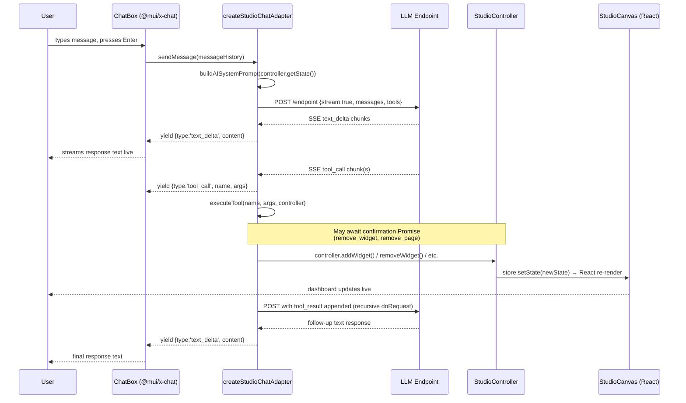
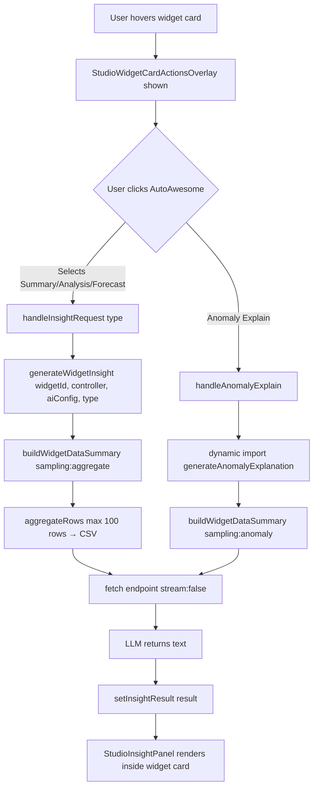
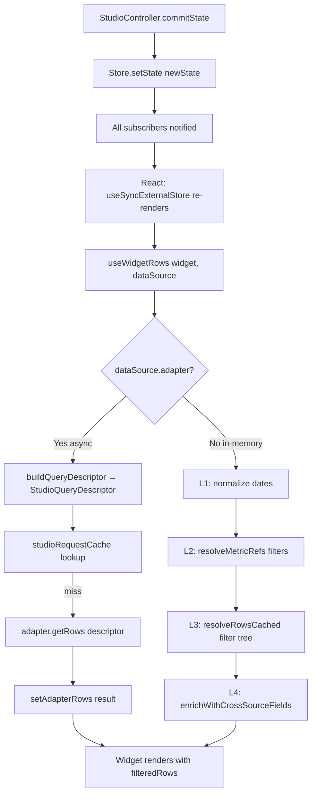
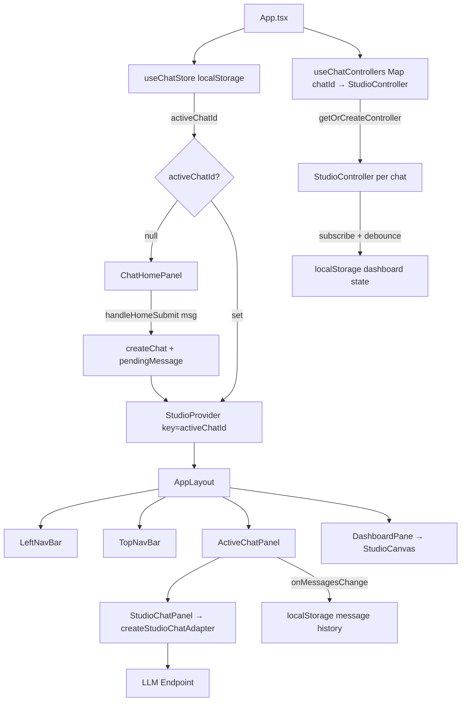

# MUI X Studio — AI Agent Reference

A comprehensive description of every AI-powered code path across the three `x-studio` example
applications: `examples/x-studio`, `examples/x-studio-composed`, and `examples/x-studio-ai`.

---

## Table of Contents

1. [Three Example Apps — Overview](#1-three-example-apps--overview)
2. [Entry Points per App](#2-entry-points-per-app)
3. [AI System Prompt — `buildAISystemPrompt`](#3-ai-system-prompt--buildaisystemprompt)
4. [Multi-Turn Chat Pipeline — `studioAdapter.ts`](#4-multi-turn-chat-pipeline--studioadapterts)
   - 4.1 `createStudioChatAdapter`
   - 4.2 `doRequest` — agentic loop
   - 4.3 `processStream` — SSE streaming
   - 4.4 `toOpenAIMessages` — message serialization
   - 4.5 Tool definitions (all 15 tools)
   - 4.6 `executeTool` — tool dispatch
5. [Data Summarization — `generateInsight.ts`](#5-data-summarization--generateinsightts)
   - 5.1 `generateWidgetInsight`
   - 5.2 `generateDashboardSummary`
   - 5.3 `generateAnomalyExplanation`
   - 5.4 `buildWidgetDataSummary` — sampling strategies
6. [Widget Creation from Description](#6-widget-creation-from-description)
7. [StudioController — State Mutations](#7-studiocontroller--state-mutations)
8. [Data Query Pipeline — `useWidgetRows`](#8-data-query-pipeline--usewidgetrows)
9. [Result Display per Path](#9-result-display-per-path)
10. [Feature Comparison Matrix](#10-feature-comparison-matrix)
11. [Data Flows — Mermaid Diagrams](#11-data-flows--mermaid-diagrams)

---

## 1. Three Example Apps — Overview

| App | Entry | AI mode | Drawers |
|---|---|---|---|
| `examples/x-studio` | `<Studio>` monolith | FAB overlay | Compose / Data / Filters — all shown |
| `examples/x-studio-composed` | `StudioProvider` + primitives | `<StudioChatPanel overlay={false}>` in sidebar | Compose only |
| `examples/x-studio-ai` | `StudioProvider` + primitives | `<StudioChatPanel>` always-visible side panel | None — fully AI-driven |

All three use the same underlying `@mui/x-studio` package.  The differences are purely
compositional — the monolith `<Studio>` is itself thin orchestration over `StudioProvider` +
`StudioCanvas` + drawer components.

---

## 2. Entry Points per App

### 2.1 `examples/x-studio`

```
src/App.tsx
  └─ <Studio
       aiConfig={{ endpoint: import.meta.env.LLM_ENDPOINT, ... }}
       featureFlags={{ compose: true, filters: true, dataManagement: true, aiChat: true }}
       dataSources={...}
     />
```

`<Studio>` (`packages/x-studio/src/Studio/Studio.tsx:672–740`) creates a single internal
`StudioController`, wraps it in `StudioProvider`, and renders `StudioContent` with all drawers.
The AI FAB is rendered at `bottom: 20, right: 20`; a secondary "Summarise dashboard" button at
`bottom: 76, right: 20`.  Both are gated by `features.aiChat && aiConfig?.endpoint`.

`StudioChatPanel` is **lazy-loaded** (`React.lazy`, `Studio.tsx:52–58`) inside a
`<React.Suspense fallback={null}>` — it is only downloaded when the user first opens the chat.

### 2.2 `examples/x-studio-composed`

```
src/App.tsx
  └─ <StudioProvider controller={controller} aiConfig={aiConfig}>
       <StudioCanvas />
       <StudioChatPanel
         aiConfig={aiConfig}
         open={chatOpen}
         overlay={false}   ← persistent sidebar, not a FAB overlay
       />
     </StudioProvider>
```

`StudioChatPanel` is rendered **eagerly** (not lazy) since the app controls the import directly.
The panel is always-mounted; `open` prop controls visibility.  No dashboard summary FAB;
no `generateDashboardSummary` call.

### 2.3 `examples/x-studio-ai`

```
src/App.tsx
  └─ <StudioProvider controller={activeController} key={activeChatId}>
       <AppLayout />
     </StudioProvider>

AppLayout.tsx
  ├─ <TopNavBar />
  ├─ <LeftNavBar />
  └─ {activeChatId === null
       ? <ChatHomePanel onSubmit={handleHomeSubmit} />
       : <>
           <ActiveChatPanel chatId={activeChatId} />
           <DashboardPane />
         </>
     }

ActiveChatPanel.tsx
  └─ <StudioChatPanel aiConfig={aiConfig} />   ← always-visible, not overlay
```

Multiple chat sessions each own a `StudioController` stored in a `Map<chatId, StudioController>`
held in a `useRef` (survives `StudioProvider` remounts triggered by `key={activeChatId}`).
Per-chat dashboard state is serialized to `localStorage` via a `subscribe()` + debounce
auto-save pattern.  Per-chat conversation history is persisted via
`slotProps.chatBox.onMessagesChange` to `localStorage`.

---

## 3. AI System Prompt — `buildAISystemPrompt`

**File:** `packages/x-studio/src/internals/buildAISystemPrompt.ts` (285 lines)

Called from `createStudioChatAdapter` (`studioAdapter.ts:164`) at the start of every
`doRequest` invocation to build a fresh snapshot of current state.

### 3.1 What it contains

The prompt is **schema-only** — it never includes raw data rows.

```
§1  Role declaration
    "You are an AI assistant built into Studio..."

§2  Tool usage guidelines
    - Use add_page before add_widget
    - Prefer updating existing widgets over removing and re-adding

§3  Dashboard meta
    - Dashboard title, active page title, mode (edit|view)

§4  Available data sources  [describeSource()]
    For each StudioDataSource:
      - id, label, aiDescription (full free-text field description)
      - List of StudioDataFields: id, type, label, aiDescription, aiAggregation
      - Count of available rows

§5  Cross-source relationships
    - For each StudioRelationship: source→target field mapping

§6  Filter presets (if any)
    - id + label of named filter presets

§7  Active-page widget list  [describeWidget()]
    For each StudioWidget on the active page:
      - widgetId, kind, title, sourceId
      - Configured fields (xField, yField, seriesField, groupByField, gridColumns, ...)
      - Applied filters (scope, field, operator, value)

§8  Expression fields
    - id, label, formula

§9  Pages list
    - All page ids + titles (not just active)

§10 Response format
    "Respond naturally... never reveal internal tool names..."
```

### 3.2 What it excludes

- Raw data rows (never sent to the LLM in the main chat path)
- `shell` state (transient UI: selectedWidgetId, open drawers)
- `dataSources.adapter` references (adapter is a function, not serializable)

### 3.3 Live refresh

The adapter calls `buildAISystemPrompt(controller.getState())` inside `doRequest` **on every
request** (not cached), so the LLM always sees the latest dashboard state.  The `get_dashboard_state`
tool (`studioAdapter.ts:179`) lets the model explicitly re-read state mid-conversation.

---

## 4. Multi-Turn Chat Pipeline — `studioAdapter.ts`

**File:** `packages/x-studio/src/StudioChatPanel/studioAdapter.ts` (~530 lines)

### 4.1 `createStudioChatAdapter`

```ts
// studioAdapter.ts:140–220
export function createStudioChatAdapter(
  aiConfig: StudioAIConfig,
  controller: StudioController,
  onRemoveWidgetRequest: (widgetId: string) => Promise<boolean>,
  onRemovePageRequest: (pageId: string) => Promise<boolean>,
): StudioChatAdapter
```

Returns a `ChatAdapter`-compatible object:

```ts
{
  sendMessage: async (messages, options) => AsyncIterable<ChatAdapterEvent>
}
```

This is the object that `StudioChatPanel` passes to `<ChatBox>` (or equivalent chat composer)
from `@mui/x-chat`.  `@mui/x-chat` calls `adapter.sendMessage(messageHistory, { signal })`
on every user submission, iterates the async iterable, and feeds events into its message store.

### 4.2 `doRequest` — the agentic loop

```ts
// studioAdapter.ts:226–380
async function* doRequest(
  messages: OpenAIMessage[],
  aiConfig: StudioAIConfig,
  controller: StudioController,
  tools: OpenAITool[],
  systemPrompt: string,
  onRemoveWidgetRequest,
  onRemovePageRequest,
  signal?: AbortSignal,
): AsyncGenerator<ChatAdapterEvent>
```

The loop:

```
1. Build request body:
     { model, stream: true, messages: [system, ...history], tools, tool_choice: 'auto' }

2. fetch(aiConfig.endpoint, { method: 'POST', body: JSON.stringify(requestBody), signal })

3. Yield events from processStream(response.body) — yields text deltas as they arrive

4. After stream ends, check for tool_calls in accumulated response:
     for each tool_call:
       a. Yield { type: 'tool_call', name, args }
       b. result = await executeTool(tool_call, controller, onRemoveWidgetRequest, onRemovePageRequest)
       c. Yield { type: 'tool_result', toolCallId, result }

5. If any tool was called:
     Append assistant message + all tool results to messages
     Recurse: yield* doRequest(updatedMessages, ...)  ← agentic follow-up

6. If no tool was called (or all tools produced results with no further action):
     Return — generator is exhausted
```

**Max depth:** not explicitly capped, but circular tool loops are prevented in practice because
`executeTool` always returns a result and the LLM terminates when it has sufficient information.

### 4.3 `processStream` — SSE streaming

```ts
// studioAdapter.ts:45–135
async function* processStream(
  body: ReadableStream<Uint8Array>,
): AsyncGenerator<ChatAdapterEvent>
```

Parses the OpenAI streaming response format:

```
data: {"choices":[{"delta":{"content":"..."}}]}
data: {"choices":[{"delta":{"tool_calls":[{"index":0,"function":{"name":"add_widget",...}}]}}]}
data: [DONE]
```

- Text deltas → `yield { type: 'text_delta', content: delta }` — these are streamed live to the
  chat UI character-by-character
- Tool call chunks → accumulated per-index in a `toolCallAccumulator` map (handles split chunks)
- `[DONE]` → `yield { type: 'done', toolCalls: [...] }`

### 4.4 `toOpenAIMessages`

```ts
// studioAdapter.ts:390–420
function toOpenAIMessages(messages: ChatMessage[]): OpenAIMessage[]
```

Converts `@mui/x-chat` `ChatMessage[]` (which may contain `{ role, content, toolCalls, toolResults }`)
into OpenAI wire format.  Key mappings:

- `role: 'user'` → `{ role: 'user', content: string }`
- `role: 'assistant'` with tool calls → `{ role: 'assistant', tool_calls: [...] }`
- Tool results → separate `{ role: 'tool', tool_call_id, content: JSON.stringify(result) }` messages
- `role: 'assistant'` text-only → `{ role: 'assistant', content: string }`

### 4.5 Tool Definitions (all 15)

Defined in `packages/x-studio/src/StudioChatPanel/studioAITools.ts`, passed as `tools: [...]` in every request.

| Tool | Description |
|---|---|
| `get_dashboard_state` | Re-read full system prompt snapshot — model calls when state may have changed |
| `add_page` | Create a new dashboard page (title) |
| `rename_page` | Rename an existing page |
| `remove_page` | Remove a page and all its widgets — gated by `onRemovePageRequest` confirmation |
| `set_active_page` | Navigate to a page by id |
| `set_dashboard_title` | Change the top-level dashboard title |
| `add_widget` | Add a new widget (kind, title, sourceId, config, filters) to the active page |
| `update_widget` | Patch a widget's config and/or title |
| `remove_widget` | Remove a widget — gated by `onRemoveWidgetRequest` confirmation |
| `set_widget_layout` | Rearrange widgets by specifying row groupings |
| `set_widget_width` | Set the column span of a widget (3–12 columns) |
| `add_page_filter` | Add a filter scoped to the active page |
| `remove_page_filter` | Remove a page-scoped filter by ID |
| `add_widget_filter` | Add a filter scoped to a specific widget |
| `remove_widget_filter` | Remove a widget-scoped filter by ID |

### 4.6 `executeTool` — dispatch

```ts
// studioAdapter.ts:440–520
async function executeTool(
  toolCall: { name: string; arguments: Record<string, unknown> },
  controller: StudioController,
  onRemoveWidgetRequest: (id: string) => Promise<boolean>,
  onRemovePageRequest: (id: string) => Promise<boolean>,
): Promise<string>   // returns JSON string fed back to model as tool result
```

Each tool name is handled in a `switch` statement.  Confirmation-gated tools (`remove_widget`,
`remove_page`):

```ts
case 'remove_widget': {
  const confirmed = await onRemoveWidgetRequest(args.widgetId);
  if (!confirmed) return JSON.stringify({ error: 'User declined removal' });
  controller.removeWidget(args.widgetId);
  return JSON.stringify({ success: true });
}
```

`onRemoveWidgetRequest` / `onRemovePageRequest` are async Promises that resolve to `boolean`.
`StudioChatPanel` implements these by rendering an inline `<ChatConfirmation>` component below the
chat thread; the Promise is resolved when the user clicks Confirm or Cancel.

---

## 5. Data Summarization — `generateInsight.ts`

**File:** `packages/x-studio/src/StudioChatPanel/generateInsight.ts` (525 lines)

These functions are **completely separate** from the multi-turn chat pipeline.  They make
**single non-streaming** `fetch` calls and return `Promise<{ text: string }>`.  They are the only
paths that send row data to the LLM.

### 5.1 `generateWidgetInsight`

```ts
// generateInsight.ts:405–445
export async function generateWidgetInsight(
  widgetId: string,
  controller: StudioController,
  aiConfig: StudioAIConfig,
  options: StudioInsightOptions,   // type: 'summary' | 'analysis' | 'forecast'
): Promise<StudioInsightResult>
```

1. Reads widget config + data source fields from `controller.getState()`
2. Calls `buildWidgetDataSummary(widgetId, controller, aiConfig, { sampling: 'aggregate' })`
   — produces a CSV-format data preamble (max 100 rows after aggregation)
3. Builds `userPrompt` combining: widget descriptor string + CSV preamble + per-type instruction
   - `summary`: "Provide a concise plain-language summary..."
   - `analysis`: "Identify trends, patterns, and notable observations..."
   - `forecast`: "Provide a short-range forecast for the next N periods..."
4. `fetch(aiConfig.endpoint, { stream: false, messages: [system, user] })`
5. Returns `{ text: response.choices[0].message.content }`

### 5.2 `generateDashboardSummary`

```ts
// generateInsight.ts:455–476
export async function generateDashboardSummary(
  controller: StudioController,
  aiConfig: StudioAIConfig,
  options?: Pick<StudioInsightOptions, 'signal'>,
): Promise<StudioInsightResult>
```

1. Calls `buildAISystemPrompt(controller.getState())` — schema-only, **no row data**
2. Single non-streaming fetch asking for a narrative summary of the entire dashboard
3. Returns `{ text }`

**Only called from:** `Studio.tsx:331` — the "Summarise dashboard" FAB in the monolithic component.

### 5.3 `generateAnomalyExplanation`

```ts
// generateInsight.ts:489–524
export async function generateAnomalyExplanation(
  widgetId: string,
  anomalies: StudioChartAnnotation[],
  controller: StudioController,
  aiConfig: StudioAIConfig,
  options?: Pick<StudioInsightOptions, 'signal'>,
): Promise<StudioInsightResult>
```

1. Calls `buildWidgetDataSummary(widgetId, controller, aiConfig, { sampling: 'anomaly', anomalyAxisValues })`
   — oversamples rows whose x-axis values match the detected anomaly timestamps/categories
2. Single non-streaming fetch
3. Returns `{ text }`

**Only called from:** `StudioWidgetCard.tsx:297–322` (with a dynamic `import()` code-split).

### 5.4 `buildWidgetDataSummary` — sampling strategies

```ts
// generateInsight.ts:110–310
async function buildWidgetDataSummary(
  widgetId: string,
  controller: StudioController,
  aiConfig: StudioAIConfig,
  options: { sampling: 'aggregate' | 'stride' | 'tail' | 'anomaly'; anomalyAxisValues?: string[] }
): Promise<string>   // CSV preamble string
```

`MAX_DATA_ROWS = 100` rows are included.

| Strategy | Description |
|---|---|
| `aggregate` | Groups by x-axis field, aggregates numeric fields (sum/avg/count per `aiAggregation`). Used for summary, analysis, forecast. |
| `stride` | Evenly-spaced sample across all rows. Used for large datasets where trend matters more than precision. |
| `tail` | Most-recent N rows. Used for forecast (recency bias). |
| `anomaly` | Normal sample + oversampled rows around anomaly timestamps. Ensures anomalous points are in the sample. |

The `aiAggregation` field on `StudioDataField` (values: `'sum' | 'avg' | 'count' | 'none'`)
controls per-field aggregation behavior.  It has **no effect on the main chat pipeline** — only
`buildWidgetDataSummary` reads it.

---

## 6. Widget Creation from Description

**File:** `packages/x-studio/src/StudioChatPanel/createWidgetFromDescription.ts` (131 lines)

```ts
export async function createWidgetFromDescription(
  description: string,
  config: StudioAIConfig,
  controller: StudioController,
): Promise<CreateWidgetResult>
```

1. Single non-streaming fetch with `tools: [add_widget_tool]` and `tool_choice: { type: 'function', name: 'add_widget' }` — forces the model to produce an `add_widget` call
2. Parses `response.choices[0].message.tool_calls[0]` arguments
3. Merges with `createDefaultWidget(kind)` defaults
4. Calls `controller.addWidget(widget)` directly — no chat history, no agentic loop

**Only called from:** `AddWidgetView.tsx:70` inside the Compose Drawer's "Describe widget" UI.  
**Not available in** `x-studio-ai` (no Compose Drawer rendered).

This is the only AI feature that bypasses `studioAdapter.ts` entirely and calls `addWidget`
synchronously from a UI action (not from a chat message).

---

## 7. StudioController — State Mutations

**File:** `packages/x-studio/src/store/StudioController.ts` (1,299 lines)

`StudioController` wraps a `Store<StudioState>` from `@mui/x-internals`.  All mutations are
**immutable state transitions** via `commitState()`.

### 7.1 `commitState`

```ts
private commitState = (nextState: StudioState, options?: { undoable?: boolean; resetHistory?: boolean }) => {
  if (resetHistory) { this.undoStack = []; this.redoStack = []; }
  else if (undoable) {
    this.undoStack.push(this.store.state);  // current state → undo stack
    this.redoStack = [];                    // wipes redo on new action
  }
  this.store.setState(nextState);           // notifies all subscribers
};
```

`MAX_UNDO_HISTORY = 100`.  **Non-undoable** calls: `setActivePage`, `applyInteractiveFilter`,
`clearInteractiveFilter`, `loadSerializedState`.

### 7.2 Key mutation methods

| Method | Undoable | Notes |
|---|---|---|
| `addWidget(widget)` | ✅ | Appends new row at bottom of active page |
| `removeWidget(widgetId)` | ✅ | Cleans widgetColSpans, removes widget-scoped filters |
| `updateWidgetConfig(widgetId, config)` | ✅ | `undefined` values DELETE config keys; auto-infers titles |
| `addFilter(filter)` | ✅ | Page-scope filters stamped with active pageId |
| `removeFilter(filterId)` | ✅ | |
| `addPage(title)` | ✅ | Returns new page id; immediately activates |
| `removePage(pageId)` | ✅ | Removes child widgets + page-scoped filters |
| `setActivePage(pageId)` | ❌ | UI navigation only |
| `setWidgetLayout(rows)` | ✅ | Validates all widget IDs present |
| `setWidgetColSpanInRow` | ✅ | Clamped to [3,12]; auto-adjusts sibling spans |
| `setDataSourceAdapter` | ❌ | Invalidates `studioRequestCache` for sourceId |
| `loadSerializedState` | ❌ | Wipes undo/redo history |

### 7.3 `serializeState` / `loadSerializedState`

`serializeState()` excludes: `shell`, `dataSources`, cross-filter-scoped filters, empty arrays.

`loadSerializedState(serialized, shellOverrides?)`:
1. `migrateState(serialized)` — runs sequential version migrations (currently v0→v1)
2. `deserializeState(migratedState, currentDataSources)` — re-merges host-app dataSources
3. `commitState(fullState, { undoable: false, resetHistory: true })`

**Implication for `x-studio-ai`:** Adapters are not serialized.  Pattern:
```ts
controller = new StudioController();
registerAdapters(controller, salesRows);   // must be done BEFORE loadSerializedState
controller.loadSerializedState(saved);     // merges with current dataSources
```

### 7.4 `subscribe`

```ts
subscribe = (listener: (state: StudioState) => void) => this.store.subscribe(listener);
// Returns unsubscribe function
```

The React context uses `useSyncExternalStore(store.subscribe, store.getSnapshot)`.  The
`x-studio-ai` app uses `subscribe()` directly in `AppLayout.tsx` for its auto-save debounce:

```ts
controller.subscribe(debounce((state) => {
  localStorage.setItem(key, JSON.stringify(controller.serializeState()));
}, 300));
```

---

## 8. Data Query Pipeline — `useWidgetRows`

**File:** `packages/x-studio/src/internals/useWidgetRows.ts` (534 lines)  
**Factory:** `packages/x-studio/src/internals/StudioPipeline.ts` (156 lines)

Each widget type (`StudioChartWidget`, `StudioGridWidget`, `StudioKpiWidget`, etc.) calls
`useWidgetRows(widget, dataSource)` to get filtered, aggregated, enriched rows.

### 8.1 Async adapter path

When `dataSource.adapter` is set (e.g., `x-studio-composed`, `x-studio-ai`):

```
buildQueryDescriptor(widget, filters, pageId)
  → StudioQueryDescriptor { select, filter tree, groupBy, aggregations, cacheKey }
studioRequestCache.get(cacheKey)
  | cache miss → adapter.getRows(descriptor) → Promise<Row[]>
  | in-flight → await existing promise
  → setAdapterRows(result)  ← React setState → re-render
```

`StudioRequestCache` is a module-singleton SWR-style cache.  Invalidated by
`controller.setDataSourceAdapter()` (via `studioRequestCache.invalidateSource(sourceId)`).

### 8.2 Sync in-memory path

When no adapter is set (all data pre-loaded into `dataSource.rows`):

```
L1: getCachedNormalizedDataSource(dataSource, usedFieldIds)
    — normalizes date strings, caches on dataSource reference identity

L2: resolveMetricRefs([page + widget + cross-filter + interactive filters], dataSources)
    — replaces {sourceId, fieldId} metric references in filter values with computed numbers

L3: resolveRowsCached(normalizedRows, sourceId, allFilters, dataSources, relationships, expressionFields)
    — applies filter tree (condition, selection, rank-post-aggregation)
    — applies cross-source join fields
    — cache key = row-array reference + filter state reference

L4: enrichWithCrossSourceFields(filteredRows, ...)
    — adds foreign-key joined columns from related data sources
```

### 8.3 Filter scopes

| Scope | Applied by | Source |
|---|---|---|
| `page` | All widgets on active page | `addFilter` / AI `add_page_filter` tool |
| `widget` | Only the target widget | `addFilter` / AI `add_widget_filter` tool |
| `cross-filter` | Widgets sharing a source | Interactive cross-filtering |
| `interactive` | Applied by quick-filter bar | `applyInteractiveFilter` (non-undoable) |

Rank-mode widget filters are applied **post-aggregation** (inside `resolveRowsCached`).

---

## 9. Result Display per Path

### Path A — Multi-turn chat (`studioAdapter.ts`)

**Entry:** User types into `StudioChatPanel` → `@mui/x-chat`'s `ChatBox` calls
`adapter.sendMessage(messageHistory)`.

**Display:**
- Streaming text deltas → `@mui/x-chat` renders into the chat thread in real time
- Tool call events → `StudioChatPanel` renders a subtle inline indicator (e.g., "Adding widget…")
- Tool results → stored in message history; used as context for the next LLM turn
- Confirmation requests (`remove_widget`, `remove_page`) → `<ChatConfirmation>` component
  renders inline in the chat thread below the pending message
- All responses appear in the `StudioChatPanel` sidebar (x-studio-composed) or
  `ActiveChatPanel` (x-studio-ai) — **never** directly in the canvas

**Canvas mutations** happen as side effects of tool execution: `controller.addWidget()`,
`controller.removeWidget()`, etc. cause `Store.setState()` → all subscribed React components
re-render, so the canvas updates live as the AI executes tools.

### Path B — Widget insight (`generateWidgetInsight`)

**Entry:** User hovers widget card → clicks `AutoAwesome` icon → selects type from dropdown
(`Summary | Analysis | Forecast`).

**Display:** `StudioInsightPanel` renders **absolutely positioned inside the widget card** —
`position: absolute, bottom: 8, left: 8, right: 8, zIndex: 10, maxHeight: 60%`.  
Text rendered as `<Typography variant="caption" sx={{ whiteSpace: 'pre-wrap' }}>`.  
Available in **both edit and view modes** when `aiConfig?.endpoint` is set.  
Closed by the ✕ button on the panel; result discarded (no persistence).

### Path C — Anomaly explanation (`generateAnomalyExplanation`)

**Entry:** User clicks `TroubleshootIcon` on chart widget → anomaly detection enabled →
detected anomalies populate `anomalyAnnotations` → "Explain Anomaly" button appears → user clicks.

**Display:** Same `StudioInsightPanel` as Path B, inside the widget card.  
`generateAnomalyExplanation` is code-split via dynamic `import()` inside `handleAnomalyExplain`.

### Path D — Dashboard summary (`generateDashboardSummary`)

**Entry:** User clicks the `AutoAwesome` FAB at `bottom: 76, right: 20` in the monolithic
`Studio` component.

**Display:** MUI `<Drawer anchor="bottom">` slides up from the bottom of the Studio shell,
`maxHeight: 40vh`.  Text rendered as `<Typography variant="body2" sx={{ whiteSpace: 'pre-wrap' }}>`.  
**Only available in `examples/x-studio`** (the monolithic variant).

### Path E — Create widget from description (`createWidgetFromDescription`)

**Entry:** User opens Compose Drawer → Add Widget → types description in text field → Enter.

**Display:** No text response shown; the widget is added directly to the canvas.  On success,
`onCreated()` is called and the canvas scrolls to the bottom to reveal the new widget.
On error, an inline `FormHelperText` error message appears in the Compose Drawer.  
**Only available in `examples/x-studio` and `examples/x-studio-composed`** (have Compose Drawer).

---

## 10. Feature Comparison Matrix

| Feature | `x-studio` | `x-studio-composed` | `x-studio-ai` |
|---|:---:|:---:|:---:|
| Multi-turn AI chat | ✅ (FAB overlay) | ✅ (sidebar) | ✅ (always visible) |
| Widget insight (summary/analysis/forecast) | ✅ | ✅ | ✅ |
| Anomaly detection & explanation | ✅ | ✅ | ✅ |
| Dashboard summary FAB | ✅ | ❌ | ❌ |
| Create widget from description | ✅ | ✅ | ❌ |
| Compose Drawer | ✅ | ✅ | ❌ |
| Data Drawer | ✅ | ❌ | ❌ |
| Filters Drawer | ✅ | ❌ | ❌ |
| Multiple chat sessions | ❌ | ❌ | ✅ |
| Chat history persistence | ❌ | ❌ | ✅ |
| Dashboard state per-chat | ❌ | ❌ | ✅ |
| AI-generated chat titles | ❌ | ❌ | ✅ |
| Chat search / favourites | ❌ | ❌ | ✅ |

---

## 11. Data Flows — Mermaid Diagrams

### 11.1 Multi-turn AI chat pipeline



### 11.2 Widget insight pipeline



### 11.3 Data query pipeline (widget rendering)



### 11.4 `x-studio-ai` multi-session architecture



---

## Key Source File Index

| File | Lines | Purpose |
|---|---|---|
| `packages/x-studio/src/Studio/Studio.tsx` | 741 | Monolithic `<Studio>` component, FAB wiring, lazy `StudioChatPanel` |
| `packages/x-studio/src/StudioChatPanel/studioAdapter.ts` | ~530 | `createStudioChatAdapter`, `doRequest`, `processStream`, `executeTool` |
| `packages/x-studio/src/internals/buildAISystemPrompt.ts` | 285 | Schema-only system prompt builder |
| `packages/x-studio/src/StudioChatPanel/generateInsight.ts` | 525 | `generateWidgetInsight`, `generateDashboardSummary`, `generateAnomalyExplanation`, `buildWidgetDataSummary` |
| `packages/x-studio/src/StudioChatPanel/createWidgetFromDescription.ts` | 131 | AI-forced `add_widget` tool call from Compose Drawer |
| `packages/x-studio/src/StudioChatPanel/StudioChatPanel.tsx` | 380 | Chat panel component, confirmation dialogs, overlay vs persistent mode |
| `packages/x-studio/src/store/StudioController.ts` | 1,299 | All state mutations, undo/redo, serialize/load, subscribe |
| `packages/x-studio/src/store/statePersistence.ts` | 227 | `serializeState`, `deserializeState`, `migrateState` |
| `packages/x-studio/src/StudioWidgetCard/StudioWidgetCard.tsx` | ~960 | AI insight state machine, `onAiRequest` prop passthrough |
| `packages/x-studio/src/StudioWidgetCard/StudioWidgetCardActionsOverlay.tsx` | 454 | AI action buttons (insight menu, anomaly explain, onAiRequest) |
| `packages/x-studio/src/StudioInsightPanel/StudioInsightPanel.tsx` | 163 | Widget-level insight display component (inside card) |
| `packages/x-studio/src/internals/StudioPipeline.ts` | 156 | `createStudioPipeline` factory, `resolveWidgetRows` |
| `packages/x-studio/src/internals/useWidgetRows.ts` | 534 | React hook — async adapter + sync in-memory data paths |
| `packages/x-studio/src/internals/StudioRequestCache.ts` | 116 | SWR-style cache for async adapter results |
| `packages/x-studio/src/context/StudioContext.tsx` | 125 | `StudioProvider`, `useStudioController`, `useStudioSelector` |
| `examples/x-studio/src/App.tsx` | ~80 | Monolithic entry: `<Studio>` with all flags enabled |
| `examples/x-studio-composed/src/App.tsx` | ~180 | Composable entry: `StudioProvider` + `StudioChatPanel overlay={false}` |
| `examples/x-studio-ai/src/App.tsx` | ~120 | AI-first entry: per-chat controller map, `handleHomeSubmit` |
| `examples/x-studio-ai/src/hooks/useChatControllers.ts` | ~90 | `Map<chatId, StudioController>`, adapter registration |
| `examples/x-studio-ai/src/hooks/useChatStore.ts` | ~110 | `ChatSession` CRUD + localStorage |
| `examples/x-studio-ai/src/hooks/useGenerateChatTitle.ts` | ~60 | Secondary LLM call for chat title + description |
| `examples/x-studio-ai/src/components/ActiveChatPanel.tsx` | ~220 | Per-chat `StudioChatPanel` + message history persistence |
| `examples/x-studio-ai/src/dataAdapter.ts` | ~280 | In-memory query engine (filter tree, aggregation, groupBy, sort) |
